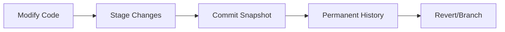

# **Chapter 1: The Digital Lab Notebook**

---

# **Introduction**

In the physical sciences, the **lab notebook** is more than a simple record; it is a legal and scientific document that ensures the integrity, reproducibility, and verifiability of research. A researcher who scribbles results on a napkin and fails to document the experimental setup, calibration settings, and raw data is not doing science—they are merely observing. The same rigor must be applied to the computational sciences.

The transition from "napkin" computation—characterized by messy folders like `final_code_v3_USE_THIS.py` and irreproducible results—to a professional **Digital Lab Notebook** is the first step in the journey of a computational physicist. This chapter establishes the "Digital Workbench," a standardized environment where code, mathematical theory ($E=mc^2$), and data visualization coexist in a single, version-controlled record. By embracing **Literate Programming** and **Version Control**, we ensure that our digital experiments are as rigorous, shareable, and verifiable as any experiment conducted in a physical laboratory.

---

# **Chapter 1: Outline**

| **Sec.** | **Title** | **Core Ideas & Examples** |
| :--- | :--- | :--- |
| **1.1** | **The Crisis of Reproducibility** | The "it worked on my machine" problem; readability, reproducibility, and verifiability; the "write-only" code trap. |
| **1.2** | **Literate Programming & Jupyter** | Knuth’s vision; combining $ \LaTeX $, Markdown, and executable Python code; the `.ipynb` format as a narrative record. |
| **1.3** | **The Scientific Stack (The Big Three)** | **NumPy** (vectorization), **SciPy** (algorithms), and **Matplotlib** (visualization); why standard Python is not enough for physics. |
| **1.4** | **Version Control with Git** | Treat code as a history of decisions; the `commit` as a timestamped lab entry; protection against data loss and regression. |
| **1.5** | **The Workbench: Anaconda & Conda** | Dependency management; creating isolated "virtual labs" (environments); why `conda` is the scientific standard. |
| **1.6** | **My First Experiment: Plotting $\sin(x)$** | A "Hello, World!" for physics; the 1.0 workflow: import, sample, calculate, visualize, and record. |

---

## **1.1 The Crisis of Reproducibility**

---

### **The "Napkin" Computation Trap**

Classic experimental science relies on a clear, unbroken chain between raw observation and final conclusion. In computation, this chain is often broken. Many researchers treat their scripts as "black boxes" that produce a result, but without documenting the **environment**, the **input parameters**, and the **version of the code** used, that result is scientifically meaningless.

!!! tip "The Three Pillars of Rigorous Computation"
    For a digital experiment to be considered scientific, it must meet three criteria:
    - **Readability:** Can a human (including your future self) understand the logic?
    - **Reproducibility:** Can another researcher run your code on a different machine and get the same result?
    - **Verifiability:** Is the link between the math (theory) and the code (implementation) transparent?

The "it worked on my machine" excuse is a symptom of a failed workflow. Professional computational physics requires an environment that is portable and a record that is complete.

---

## **1.2 Literate Programming and Jupyter**

---

### **Knuth's Vision**

In 1984, Donald Knuth introduced the concept of **Literate Programming** [1]. He argued that instead of writing code for computers to execute, we should write programs as "works of literature" for humans to read. The code should be an accompaniment to a narrative that explains the "why" behind the implementation.

**Jupyter Notebooks** are the modern realization of this dream. They allow us to blend:
- **Narrative Text:** Explanations in Markdown (like this essay).
- **Mathematics:** Formatted equations using $ \LaTeX $ syntax.
- **Runnable Code:** Live Python blocks that execute in real-time.
- **Visualizations:** Graphs and plots that update as the code changes.

!!! example "Literate Workflow"
    Instead of a comment like `# use RK4 here`, a Jupyter notebook allows you to derive the Runge-Kutta equations in a Markdown cell, then provide the Python implementation directly below it, followed by a plot showing the numerical stability. This creates a "self-documenting" experiment.

---

## **1.3 The Scientific Stack: The "Big Three"**

---

Standard Python is a general-purpose language, not a scientific computer. For physics, we need a specialized toolkit.

*   **NumPy (Numerical Python):** The bedrock of scientific Python. It introduces the **n-dimensional array** (`ndarray`), which allows for **vectorization**. Instead of using slow `for` loops to process 1,000 numbers, NumPy processes the entire array at once using optimized C and Fortran backends [5].
*   **SciPy (Scientific Python):** A library of high-level algorithms built on top of NumPy. It provides "pre-baked" solutions for integration, interpolation, optimization, and signal processing [7].
*   **Matplotlib:** The standard library for creating publication-quality figures. It allows us to turn raw numbers into physical intuition through visualization [6].

??? question "Why not just use Microsoft Excel?"
    Excel is fine for accounting, but it fails the "Three Pillars." Formulas are hidden behind cells (poor readability), it cannot handle complex algorithms like FFTs efficiently (poor scalability), and it is famously prone to hidden errors that are impossible to verify (poor verifiability).

---

## **1.4 Version Control with Git**

---

A lab notebook is never erased; mistakes are crossed out so they can still be read. **Git** is the digital equivalent. It is a **Version Control System (VCS)** that tracks every single character change in your project.

### **The Git Lifecycle**

1.  **Work:** Modify your code or notebook.
2.  **Stage (`git add`):** Select the changes that are "ready" to be recorded.
3.  **Commit (`git commit`):** Save a permanent "snapshot" of the project with a descriptive message.



!!! tip "Commit Early, Commit Often"
    Treat every `commit` as a successful "run" of an experiment. If you break your code later, Git allows you to "time travel" back to any previous state, ensuring you never lose a working solution.

---

## **1.5 The Workbench: Anaconda & Conda**

---

The "Big Three" libraries (NumPy, SciPy, Matplotlib) have hundreds of dependencies. Managing these manually is a notorious hurdle known as "dependency hell."

**Anaconda** is a distribution that bundles Python with the most popular scientific libraries. **Conda** is the package manager that accompanies it. It allows you to create **environments**—isolated logical workspaces.

| Feature | `pip` (Standard) | `conda` (Scientific) |
| :--- | :--- | :--- |
| **Focus** | Python packages only | Python + Non-Python (C/C++ libs) |
| **Isolation** | Basic | Strong (Environment-level) |
| **Science Support** | Excellent | Preferred (pre-compiled binaries) |

By using Conda, you can ensure that the version of NumPy you use today is the same one someone else uses five years from now, satisfying the **Reproducibility** requirement.

---

## **1.6 My First Experiment: Plotting $\sin(x)$**

---

The "Hello, World!" of computational physics is the generation and visualization of a function. This simple task utilizes the entire stack:
1.  **Environment:** Anaconda provides the Python interpreter.
2.  **Logic:** NumPy generates 100 discrete samples of $x$ from 0 to $2\pi$.
3.  **Calculation:** NumPy applies the `sin` function **vectorially** to all 100 points simultaneously.
4.  **Visualization:** Matplotlib renders the points as a smooth curve (a "connect-the-dots" illusion).
5.  **Record:** Git records the successful creation of the plot.

```python
import numpy as np
import matplotlib.pyplot as plt

# 1. Sample the domain
x = np.linspace(0, 2 * np.pi, 100)

# 2. Calculate the physics
y = np.sin(x)

# 3. Visualize the result
plt.plot(x, y, label="sin(x)")
plt.xlabel("Radians")
plt.ylabel("Amplitude")
plt.title("My First Scientific Record")
plt.grid(True)
plt.show()
```

---

## **Summary: Comparison of Computational Workflows**

---

| Feature | The "Napkin" Way | The "Professional" Way (Standard) |
| :--- | :--- | :--- |
| **Code Structure** | One giant script (`test.py`) | Modular libraries and Literate Notebooks |
| **Documentation** | Comments like `# fix this later` | Markdown + $ \LaTeX $ theory + derivation |
| **Tracking** | Manual backups (`v1`, `v2`, `v3`) | **Git** version control with full history |
| **Dependencies** | "Install and pray" | **Conda** isolated environments |
| **Visualization** | Screenshots of random plots | Reproducible scripts that generate figures |

---

## **References**

---

[1] Knuth, D. E. (1984). Literate Programming. *The Computer Journal*, 27(2), 97–111.

[2] Anaconda, Inc. (2020). *Anaconda Software Distribution*. [https://www.anaconda.com](https://www.anaconda.com)

[3] Pérez, F., & Granger, B. E. (2007). IPython: A System for Interactive Scientific Computing. *Computing in Science & Engineering*, 9(3), 21–29.

[4] Kluyver, T., et al. (2016). Jupyter Notebooks – a publishing format for reproducible computational workflows. *Positioning and Power in Academic Publishing*.

[5] Harris, C. R., et al. (2020). Array programming with NumPy. *Nature*, 585, 357–362.

[6] Hunter, J. D. (2007). Matplotlib: A 2D graphics environment. *Computing in Science & Engineering*, 9(3), 90–95.

[7] Virtanen, P., et al. (2020). SciPy 1.0: Fundamental algorithms for scientific computing in Python. *Nature Methods*, 17, 261–272.

[8] Chacon, S., & Straub, B. (2014). *Pro Git*. (2nd ed.). Apress.