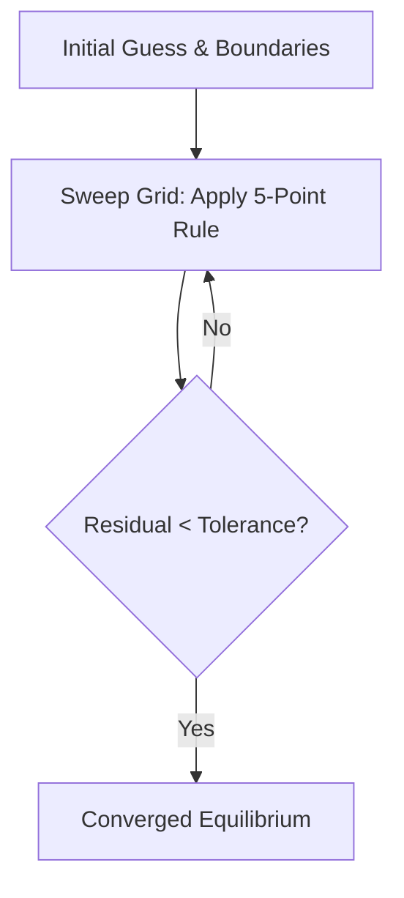

# **Chapter 10: Partial Differential Equations I (Elliptic)**

---

# **Introduction**

Up to this point, we have simulated systems that change over a single dimension—usually time ($t$) or space ($x$). However, the physical world is multi-dimensional. Gravity, electricity, and heat flow exist as **fields** that fill up space. To model these, we must move from Ordinary Differential Equations (ODEs) to **Partial Differential Equations (PDEs)**.

This chapter introduces the first of the three "Great Families" of PDEs: the **Elliptic PDE**. These equations describe systems in a state of **Equilibrium**—where the "push" and "pull" of the surroundings have settled into a stable, time-independent shape. Whether you are calculating the voltage between two electrodes or the steady-state temperature of a metal plate, you are solving **Laplace's** or **Poisson's** equations. We will extend our Finite Difference toolkit into 2D and learn how to "relax" a digital mesh into physical equilibrium.

---

# **Chapter 10: Outline**

| **Sec.** | **Title** | **Core Ideas & Examples** |
| :--- | :--- | :--- |
| **10.1** | **The PDE Taxonomy** | Elliptic (Equilibrium), Parabolic (Diffusion), Hyperbolic (Waves). |
| **10.2** | **The 2D Laplacian** | Extending the stencil; $\nabla^2 \phi = 0$; the "5-Point Average" rule. |
| **10.3** | **Iterative Relaxation** | The "Rubber Sheet" analogy; solving by iteration instead of direct inversion. |
| **10.4** | **Jacobi vs. Gauss-Seidel** | Synchronous vs. Asynchronous updates; memory and speed trade-offs. |
| **10.5** | **SOR (Successive Over-Relaxation)** | Accelerating convergence; the over-relaxation factor $\omega$; the spectral radius. |
| **10.6** | **Boundary Conditions in 2D** | Dirichlet (Fixed Value) vs. Neumann (Fixed Flux); the physical meaning of edges. |

---

## **10.1 The 2D Laplacian: The 5-Point Average**

---

In 2D, the Laplacian operator is $\nabla^2 \phi = \frac{\partial^2 \phi}{\partial x^2} + \frac{\partial^2 \phi}{\partial y^2}$. Discretizing both directions with central differences gives the **Five-Point Stencil**:

$$ \nabla^2 \phi \approx \frac{\phi_{i+1,j} - 2\phi_{i,j} + \phi_{i-1,j}}{h^2} + \frac{\phi_{i,j+1} - 2\phi_{i,j} + \phi_{i,j-1}}{h^2} $$

For Laplace’s equation ($\nabla^2 \phi = 0$), this simplifies to a beautiful physical truth:

$$ \phi_{i,j} = \frac{1}{4} \left( \phi_{i+1,j} + \phi_{i-1,j} + \phi_{i,j+1} + \phi_{i,j-1} \right) $$

!!! tip "The Value of Average"
    Equilibrium in 2D means that every point is the **exact average** of its four neighbors. If a point were higher than the average of its neighbors, it would be a "peak" and would naturally flow outward. Equilibrium is reached when the field is as "smooth" as possible given the boundary constraints.

---

## **10.2 Iterative Relaxation: The Rubber Sheet**

---

To solve $\nabla^2 \phi = 0$ on a grid of $100 \times 100$ points, we would need to invert a matrix with $10,000^2$ elements. This is too slow. Instead, we use **Relaxation**: we start with a guess and repeatedly apply the "Average Rule" until the grid stops changing.

!!! example "The Rubber Sheet"
    Imagine pinning a rubber sheet to a custom-shaped frame (the boundaries). The shape the sheet takes is the solution to Laplace's equation. Relaxation is the digital process of letting that sheet "settle" into its minimum-energy shape.

---

## **10.3 Jacobi vs. Gauss-Seidel vs. SOR**

---

- **Jacobi:** Calculate all new values using only the *old* values from the previous pass. Slow.
- **Gauss-Seidel:** Use the *newest* available values as you sweep. Typically **2x faster** than Jacobi.
- **SOR (Successive Over-Relaxation):** Don't just move to the average; "overshoot" the target by a factor $\omega$ ($1 < \omega < 2$).

$$ \phi_{\text{new}} = (1-\omega)\phi_{\text{old}} + \omega \phi_{\text{GS}} $$

??? question "Why overshoot a solution?"
    In large grids, information travels very slowly (one cell per iteration). SOR "pushes" the information across the grid faster. For a $100 \times 100$ grid, SOR can be **50x faster** than Gauss-Seidel with a properly tuned $\omega$.

---

## **10.4 Dirichlet vs. Neumann Boundaries**

---

1.  **Dirichlet:** You specify the **value** at the edge (e.g., "The wall is exactly $100^\circ$").
2.  **Neumann:** You specify the **derivative** or flux at the edge (e.g., "The wall is perfectly insulated, so no heat flows through it").

In terms of the grid, Neumann conditions involve "Ghost Points"—imaginary points outside the boundary that are forced to match the interior slope.

---

## **Summary: Iterative PDE Solvers Comparison**

---

| Method | Speed | Memory | Complexity | Note |
| :--- | :--- | :--- | :--- | :--- |
| **Jacobi** | Slowest | High (2 grids) | Very Low | Parallel-friendly |
| **Gauss-Seidel** | Moderate (2x) | Low (1 grid) | Low | Serial standard |
| **SOR** | **Fastest** | Low (1 grid) | Moderate | Requires tuning $\omega$ |
| **Multigrid** | **Infinite** | High | Extreme | The "Gold Standard" for massive meshes |

---

## **References**

---

[1] Press, W. H., et al. (2007). *Numerical Recipes: The Art of Scientific Computing*. Cambridge University Press.

[2] Ames, W. F. (2014). *Numerical Methods for Partial Differential Equations*. Academic Press.

[3] Morton, K. W., & Mayers, D. F. (2005). *Numerical Solution of Partial Differential Equations*. Cambridge University Press.

[4] Young, D. M. (1971). *Iterative Solution of Large Linear Systems*. Academic Press.

[5] Strikwerda, J. C. (2004). *Finite Difference Schemes and Partial Differential Equations*. SIAM.