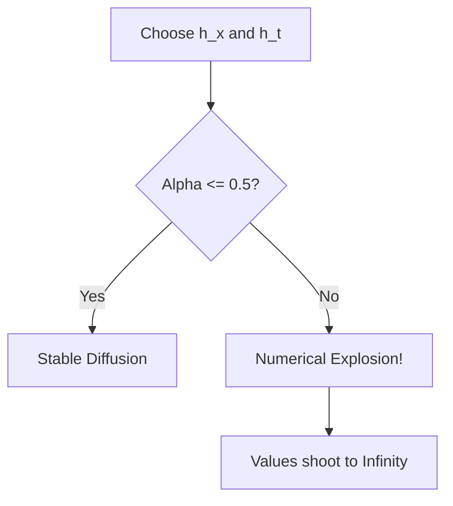

# **Chapter 11: Partial Differential Equations II (Parabolic)**

---

# **Introduction**

In Chapter 10, we solved for the "end of the story"—the static, equilibrium state where nothing changes in time. But physics is rarely static. We must now ask: "How does the system *get* to equilibrium?" This process of spreading and smoothing is known as **Diffusion**. Whether it is heat propagating through a metal rod, a drop of ink spreading in water, or a financial "shock" diffusing through a market, the governing rule is the **Heat Equation**, the classic **Parabolic PDE**.

Solving the Heat Equation requires a hybrid approach. It is an **Initial Value Problem** in time (how it starts) and a **Boundary Value Problem** in space (where it's contained). This chapter explores the "Stability War" of parabolic systems. We will move from the intuitive but fragile **FTCS** method to the "Gold Standard" **Crank-Nicolson** method, learning why "Implicit" math is the only way to avoid numerical explosions.

---

# **Chapter 11: Outline**

| **Sec.** | **Title** | **Core Ideas & Examples** |
| :--- | :--- | :--- |
| **11.1** | **The Physics of Spreading** | The Heat Equation; diffusion coefficients; the link between space and time derivatives. |
| **11.2** | **Explicit FTCS (First Attempt)** | Forward-Time Centered-Space; the "Marching" grid; the $O(h_t, h_x^2)$ mismatch. |
| **11.3** | **The CFL Stability Limit** | Why $h_t$ is trapped by $h_x^2$; the $\alpha \leq 0.5$ rule; numerical "explosions." |
| **11.4** | **Implicit BTCS (Backward Time)** | Avoiding the explosion; solving a matrix at every time step; unconditional stability. |
| **11.5** | **Crank-Nicolson (The Standard)** | The "Average" approach; 2nd-order accuracy in time and space; the tridiagonal system. |

---

## **11.1 The Explicit FTCS Scheme**

---

The **FTCS** (Forward-Time Centered-Space) method is the most intuitive approach. We use a first-order Euler forward step for time and a second-order central difference for space:

$$ \frac{T_i^{n+1} - T_i^n}{\Delta t} = D \frac{T_{i+1}^n - 2T_i^n + T_{i-1}^n}{\Delta x^2} $$

We define the **Diffusion Number** $\alpha = D \frac{\Delta t}{\Delta x^2}$. The update becomes:
$$ T_i^{n+1} = T_i^n + \alpha (T_{i+1}^n - 2T_i^n + T_{i-1}^n) $$

---

## **11.2 The CFL Condition: The Stability Wall**

---

FTCS is **Explicit**: the future depends only on the present. This creates a dangerous "speed limit." If your time step $\Delta t$ is too large, the error inside the simulation grows exponentially.

$$ \alpha = D \frac{\Delta t}{\Delta x^2} \leq \frac{1}{2} $$

!!! tip "The Tyranny of $h_x^2$"
    Because $\Delta t \propto \Delta x^2$, if you want to double the spatial resolution (10x more points), you must make the time step **100x smaller**. This makes FTCS impractically slow for high-resolution physics.

---

## **11.3 Implicit BTCS: Breaking the Wall**

---

To ignore the CFL limit, we use an **Implicit** method (Backward-Time). Instead of looking at the *current* curvature, we look at the *future* curvature. This forces us to solve a system of linear equations at every step:

$$ (1 + 2\alpha)T_i^{n+1} - \alpha T_{i+1}^{n+1} - \alpha T_{i-1}^{n+1} = T_i^n $$

!!! tip "Unconditional Stability"
    Implicit methods are **Unconditionally Stable**. You can take a time step 1,000 times larger than the CFL limit, and the simulation will still produce a smooth, physically plausible result. You pay for this stability by solving a **Tridiagonal Matrix** at each step.

---

## **11.4 Crank-Nicolson: The Gold Standard**

---

**Crank-Nicolson** is the "best of both worlds." It averages the explicit and implicit steps, resulting in a method that is:
1.  **Unconditionally Stable** (like BTCS).
2.  **Second-Order Accurate** in time ($O(\Delta t^2)$) and space ($O(\Delta x^2)$).

It remains the workhorse for diffusion problems in everything from chemical engineering to the Black-Scholes model in finance.

---

## **Summary: Diffusion Solver Comparison**

---

| Method | Type | Stability | Accuracy | Note |
| :--- | :--- | :--- | :--- | :--- |
| **FTCS** | Explicit | **Conditional** ($\alpha \leq 0.5$) | $O(\Delta t, \Delta x^2)$ | Simple but explodes easily |
| **BTCS** | Implicit | **Unconditional** | $O(\Delta t, \Delta x^2)$ | Safe, 1st-order in time |
| **Crank-Nicolson**| Implicit | **Unconditional** | $O(\Delta t^2, \Delta x^2)$ | **Professional Standard** |

---

## **References**

---

[1] Press, W. H., et al. (2007). *Numerical Recipes: The Art of Scientific Computing*. Cambridge University Press.

[2] Crank, J., & Nicolson, P. (1947). A practical method for numerical evaluation of solutions of partial differential equations of the heat-conduction type. *CUP*.

[3] Morton, K. W., & Mayers, D. F. (2005). *Numerical Solution of Partial Differential Equations*. Cambridge University Press.

[4] Richtmyer, R. D., & Morton, K. W. (1967). *Difference Methods for Initial-Value Problems*. Interscience.

[5] Wilmott, P., et al. (1995). *The Mathematics of Financial Derivatives*. Cambridge University Press.