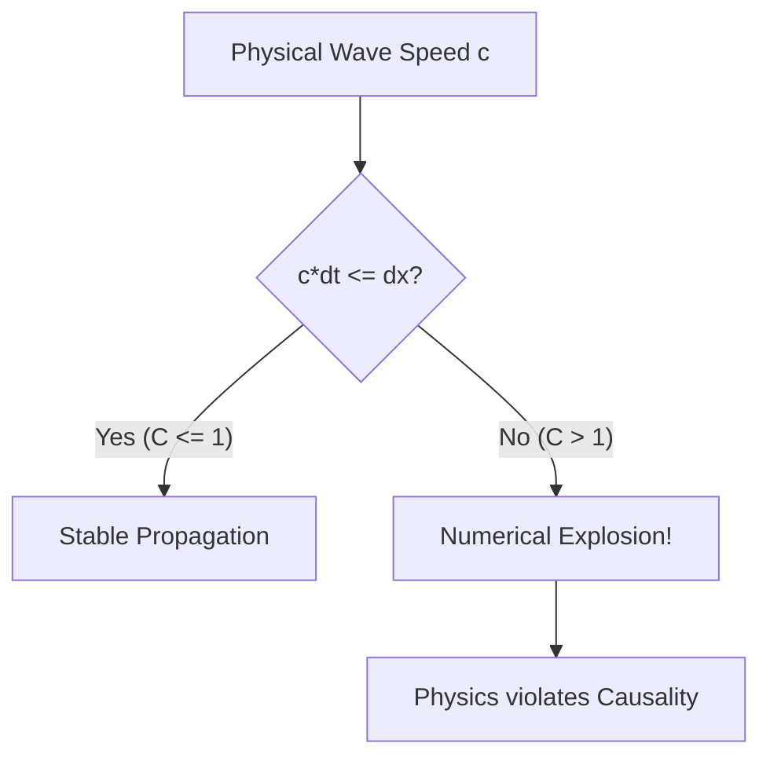

# **Chapter 12: Partial Differential Equations III (Hyperbolic)**

---

# **Introduction**

In the previous chapters, we modeled systems in equilibrium (Chapter 10) and systems that diffuse their energy (Chapter 11). This chapter introduces the final "Great Family" of PDEs: the **Hyperbolic PDE**. These equations govern **Wave Propagation**—the movement of energy and information through space without loss of shape. Whether it is a vibrating guitar string, a ripple on a pond, or a pulse of light, the physics is defined by the **Wave Equation**.

Unlike diffusion, waves are **Second-Order in Time**. This small mathematical change transforms the behavior of the system from "smoothing out" to "oscillating." However, waves also bring a strict numerical "speed limit." If our digital signal tries to move faster than one grid cell per time step, the simulation will explode. This chapter defines the **Courant-Friedrichs-Lewy (CFL)** condition for waves and introduces the **Leapfrog** and **Lax-Friedrichs** schemes for stable propagation.

---

# **Chapter 12: Outline**

| **Sec.** | **Title** | **Core Ideas & Examples** |
| :--- | :--- | :--- |
| **12.1** | **The Physics of Propagation** | Flux and conservation; the Wave Equation; waves vs. diffusion; the parameter $c$. |
| **12.2** | **Explicit Wave Stepping** | The 3-level recurrence relation; $2^{\text{nd}}$-order time discretization. |
| **12.3** | **The Courant Condition (CFL)** | The numerical speed limit; $C = c\Delta t / \Delta x \leq 1$; signal causality. |
| **12.4** | **Stability & Dissipation** | Numerical dispersion; the Lax-Friedrichs fix; staggered Leapfrog grids. |
| **12.5** | **The "Plucked String" Case Study** | Standing waves; boundary reflections; Fourier decomposition on a grid. |

---

## **12.1 The Wave Equation: $\partial^2 y / \partial t^2$**

---

The 1D Wave Equation is given by:
$$ \frac{\partial^2 y}{\partial t^2} = c^2 \frac{\partial^2 y}{\partial x^2} $$
where $c$ is the wave speed. 

**Key Differences from Diffusion:**
1.  **Retention:** Waves keep their shape; they don't "blur" away like heat.
2.  **Inertia:** The second-order time derivative acts like Newton's $F=ma$, providing "momentum" to the field.
3.  **Boundary Interaction:** Waves reflect and interfere, creating standing patterns.

---

## **12.2 Explicit Time Stepping: The 3-Level Scheme**

---

Because the equation is 2nd-order in time, we need three time levels to calculate the future: **Past**, **Present**, and **Future**.

$$ \frac{y_i^{n+1} - 2y_i^n + y_i^{n-1}}{\Delta t^2} = c^2 \frac{y_{i+1}^n - 2y_i^n + y_{i-1}^n}{\Delta x^2} $$

Rearranging for the future $y_i^{n+1}$:
$$ y_i^{n+1} = 2y_i^n - y_i^{n-1} + C^2 (y_{i+1}^n - 2y_i^n + y_{i-1}^n) $$
where $C = c\Delta t / \Delta x$ is the **Courant Number**.

---

## **12.3 The Courant Condition: The Speed Limit**

---

For the wave simulation to be stable, the physical wave must not travel further than one grid cell ($\Delta x$) in one time step ($\Delta t$).

$$ C = \frac{c \Delta t}{\Delta x} \leq 1 $$

!!! tip "C=1 is the 'Sweet Spot'"
    In 1D, setting $C=1$ (where the wave moves exactly one cell per step) is often the most accurate setting, as it minimizes **Numerical Dispersion** (the "blurring" of the wave shape).

---

## **12.4 The Plucked String: Boundary Reflection**

---

When a wave hits a fixed boundary ($y=0$), it reflects upside-down. This is handled naturally by our grid boundaries.

!!! example "Vibrating String"
    To simulate a plucked guitar string:
    1.  **Initialize:** Set $y(x, 0)$ to a triangular shape.
    2.  **Start:** Use a special first step (since $y^{n-1}$ is unknown at $t=0$).
    3.  **March:** Run the 3-level scheme.
    You will see the triangle split into two waves that travel, reflect, and eventually form the fundamental harmonic of the string.

---

## **Summary: The "Big Three" PDEs**

---

| PDE Family | Example | Physical State | Time Order | Numerical Standard |
| :--- | :--- | :--- | :--- | :--- |
| **Elliptic** | Laplace | **Equilibrium** | None | Relaxation (SOR) |
| **Parabolic** | Heat | **Diffusion** | 1st Order | Crank-Nicolson |
| **Hyperbolic** | Wave | **Propagation**| 2nd Order | Explicit FTCS ($C \leq 1$) |

---

## **References**

---

[1] Press, W. H., et al. (2007). *Numerical Recipes: The Art of Scientific Computing*. Cambridge University Press.

[2] Courant, R., Friedrichs, K., & Lewy, H. (1928). Über die partiellen Differenzengleichungen der mathematischen Physik. *Mathematische Annalen*.

[3] Morton, K. W., & Mayers, D. F. (2005). *Numerical Solution of Partial Differential Equations*. Cambridge University Press.

[4] Strikwerda, J. C. (2004). *Finite Difference Schemes and Partial Differential Equations*. SIAM.

[5] Trefethen, L. N. (1982). Group velocity in finite difference schemes. *SIAM Review*.