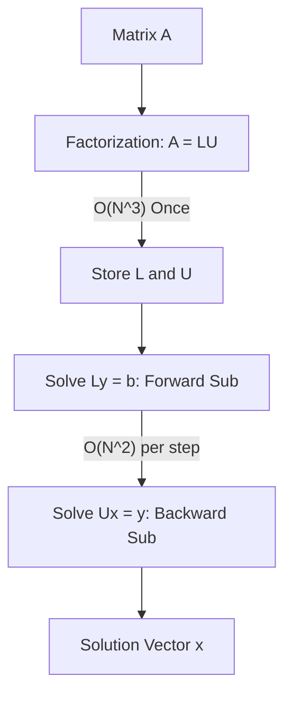

# **Chapter 13: Linear Algebra I (Direct Methods)**

---

# **Introduction**

Every numerical method we have discussed so far—from root finding and fitting to solving complex Partial Differential Equations—eventually boils down to a single mathematical structure: the **System of Linear Equations**.

$$ \mathbf{A} \mathbf{x} = \mathbf{b} $$

In this equation, $\mathbf{A}$ is a matrix of "rules" (often derived from a physics grid), $\mathbf{b}$ is a vector of "sources" (like boundary conditions or external forces), and $\mathbf{x}$ is the "solution" we seek. Linear Algebra is the engine of scientific computing. However, as our physical models grow in resolution, our matrices grow to millions of elements. This chapter explores the "Direct" methods for solving these systems, moving from the classroom logic of **Gaussian Elimination** to the high-performance **LU Decomposition** and the super-fast **Thomas Algorithm**.

---

# **Chapter 13: Outline**

| **Sec.** | **Title** | **Core Ideas & Examples** |
| :--- | :--- | :--- |
| **13.1** | **The $Ax=b$ Engine** | Why all physics ends in linear algebra; matrix representation of grids. |
| **13.2** | **The Cost of Naivety** | Why we **never** compute the matrix inverse $\mathbf{A}^{-1}$; $O(N^3)$ vs. $O(N^2)$. |
| **13.3** | **Gaussian Elimination & Pivoting** | Row operations; the danger of small denominators; Partial Pivoting. |
| **13.4** | **LU Decomposition (The Workhorse)** | Factoring $A$ into $L$ (Lower) and $U$ (Upper); "Factor Once, Solve Many." |
| **13.5** | **The Thomas Algorithm ($\mathcal{O}(N)$)** | Specialized solver for tridiagonal systems (1D grids); breaking the $N^3$ wall. |

---

## **13.1 The Cost of Naivety: Don't Invert!**

---

In a math textbook, the solution to $\mathbf{A}\mathbf{x} = \mathbf{b}$ is $\mathbf{x} = \mathbf{A}^{-1}\mathbf{b}$. In a computer, this is a **disaster**.

1.  **Speed:** Calculating an inverse takes 3-4 times more work than a direct solve.
2.  **Precision:** Inversion is numerically unstable. It magnifies round-off errors, especially for "Ill-conditioned" matrices.

!!! tip "Standard Rule"
    **Never** use `np.linalg.inv(A) @ b`. Always use a dedicated solver like `np.linalg.solve(A, b)` or an LU decomposition. The solver is faster, uses less memory, and is more accurate.

---

## **13.2 LU Decomposition: Factor Once, Solve Many**

---

In many simulations (like the Heat Equation), the matrix $\mathbf{A}$ stays the same while the source $\mathbf{b}$ changes at every time step. **LU Decomposition** exploits this by splitting $\mathbf{A}$ into two triangular matrices:
- **L (Lower):** All zeros above the diagonal.
- **U (Upper):** All zeros below the diagonal.

!!! example "Why use LU?"
    If you have a $1000 \times 1000$ system and you need to solve it 5000 times:
    - **Gaussian Elimination:** $O(N^3)$ per step $\times 5000$ steps = Massive cost.
    - **LU Decomposition:** $O(N^3)$ once + $5000 \times O(N^2)$ steps = **1000x faster overall.**

---

## **13.3 The Thomas Algorithm: Breaking the Wall**

---

For many 1D physics problems (like the vibrating string or heat rod), each point only talks to its two neighbors. This creates a **Tridiagonal Matrix** (nonzero only on the main diagonal and its two neighbors).

The **Thomas Algorithm** is a specialized version of Gaussian elimination for these matrices. It skips all the zeros and achieves a computational cost of **$\mathcal{O}(N)$**.

| Matrix Type | General Solver | Thomas Solver |
| :--- | :--- | :--- |
| **$N = 1,000$** | 1 Billion Ops | **3,000 Ops** |
| **$N = 1,000,000$** | Impossible | **3 Million Ops** |

---

## **13.4 Pivoting: Protecting Precision**

---

If the computer tries to divide by a very small number (the "pivot") during elimination, the result will blow up. **Partial Pivoting** prevents this by swapping rows so that the largest available number is always on the diagonal.

??? question "Is my matrix well-conditioned?"
    A matrix is "Ill-conditioned" if its determinant is very close to zero. In this state, a tiny change in your input $\mathbf{b}$ leads to a massive, random change in your output $\mathbf{x}$. Always check the **Condition Number** of your matrix before trusting a solution.

---

## **Summary: Direct Linear Solver Comparison**

---

| Method | Complexity | Best For | Note |
| :--- | :--- | :--- | :--- |
| **Gaussian Elim.** | $\mathcal{O}(N^3)$ | One-off small systems | Simple but inefficient |
| **LU Decomp.** | $\mathcal{O}(N^3) \to \mathcal{O}(N^2)$ | **Repeated solves** | **The Industry Workhorse** |
| **Cholesky** | $\mathcal{O}(N^3)$ | Symmetric matrices | 2x faster than LU |
| **Thomas** | $\mathcal{O}(N)$ | **Tridiagonal (1D Grids)** | **Extreme speed at scale** |

---

## **References**

---

[1] Press, W. H., et al. (2007). *Numerical Recipes: The Art of Scientific Computing*. Cambridge University Press.

[2] Golub, G. H., & Van Loan, C. F. (2013). *Matrix Computations*. Johns Hopkins University Press.

[3] Trefethen, L. N., & Bau, D. (1997). *Numerical Linear Algebra*. SIAM.

[4] Higham, N. J. (2002). *Accuracy and Stability of Numerical Algorithms*. SIAM.

[5] Strang, G. (2006). *Linear Algebra and Its Applications*. Thomson Brooks/Cole.