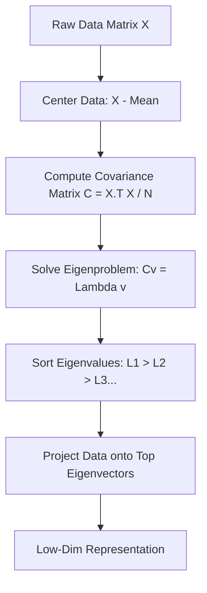

# **Chapter 16: Statistical Analysis and PCA**

---

# **Introduction**

Throughout this volume, we have built powerful engines for generating data—simulating planets, waves, and heat. But as our simulations grow more complex, they produce a "Data Deluge." A single simulation of a folding protein might produce millions of coordinates across thousands of time steps. How do we find the "Signal" inside this massive "Noise"?

This chapter introduces the tools of **Dimensionality Reduction**. When faced with 1,000 variables, we often find that the system is actually governed by just 2 or 3 "hidden" variables that capture most of the action. To find them, we use the final application of our linear algebra toolkit: **Principal Component Analysis (PCA)**. By combining statistics with the Eigenvalue problem, we will learn how to "squash" high-dimensional complexity into low-dimensional insight, revealing the true axes of variance in any dataset.

---

# **Chapter 16: Outline**

| **Sec.** | **Title** | **Core Ideas & Examples** |
| :--- | :--- | :--- |
| **16.1** | **The Gaussian Standard** | Mean, Variance, and Std Dev; the Central Limit Theorem; why noise is "Normal." |
| **16.2** | **Covariance & Correlation** | How variables move together; the Covariance Matrix $\mathbf{C}$; identifying relationships. |
| **16.3** | **PCA: Finding the Axes** | The "Master Rotation"; finding directions of maximum variance; the SVD connection. |
| **16.4** | **Dimensionality Reduction** | The "Scree Plot"; keeping the Top-K components; filtering noise via projection. |
| **16.5** | **Eigen-Physics** | Eigen-faces, Eigen-modes, and Eigen-trajectories; PCA as a physical change of basis. |

---

## **16.1 Covariance: The Link Between Variables**

---

In high-dimensional data, variables are rarely independent. If you measure the height and weight of 1,000 people, the two variables are **correlated**.
The **Covariance Matrix** $\mathbf{C}$ captures these relationships for every pair of variables:

$$ C_{ij} = \text{cov}(X_i, X_j) = E[(X_i - \mu_i)(X_j - \mu_j)] $$

The diagonal elements ($C_{ii}$) are just the variances of each variable, while the off-diagonal elements tell us how much they "swing together."

---

## **16.2 PCA: The Principal Components**

---

**Principal Component Analysis (PCA)** is the process of finding a new coordinate system (a new basis) where the first axis points along the direction of the **maximum variance** in the data.

!!! tip "PCA is a Change of Basis"
    PCA doesn't just "delete" data; it **rotates** the data. The first Principal Component (PC1) is the single most important direction in the dataset. If you could only look at the data through a 1D "slit," you would align that slit with PC1 to see the most information.

---

## **16.3 The Scree Plot: How much is enough?**

---

How many dimensions do we need to keep? We look at the **Eigenvalues** ($\lambda_i$). Each eigenvalue represents the amount of variance ("information") captured by that component.

!!! example "The 90% Rule"
    In professional data analysis, we often keep enough Principal Components to account for **90% of the total variance**. If the first 3 components capture 92% of the variance in a 1,000-variable system, we can safely ignore the other 997 variables as "noise."

??? question "Should I use SVD or Covariance?"
    In code, calculating the Covariance matrix $X^T X$ can be numerically unstable if the numbers are very large or small. The **Singular Value Decomposition (SVD)** is the "Pro Way" to do PCA. It finds the Principal Components directly from the data matrix $X$ without ever forming the Covariance matrix.

---

## **Summary: Statistics vs. PCA**

---

| Feature | Descriptive Stats | PCA Analysis |
| :--- | :--- | :--- |
| **Scope** | Single variable ($\mu, \sigma$) | **Multi-variable** relationships |
| **Goal** | Hardware check (Mean/Range) | **Pattern Discovery** (Structure) |
| **Output** | Numbers (Average) | **Axes** (Directions) |
| **Complexity**| Low | **High** (Eigen-problem) |

---

## **References**

---

[1] Jolliffe, I. T. (2002). *Principal Component Analysis*. Springer.

[2] Pearson, K. (1901). On lines and planes of closest fit to systems of points in space. *Philosophical Magazine*.

[3] Shlens, J. (2014). A Tutorial on Principal Component Analysis. *arXiv*.

[4] Strang, G. (2016). *Introduction to Linear Algebra*. Wellesley-Cambridge Press.

[5] Hastie, T., et al. (2009). *The Elements of Statistical Learning*. Springer.