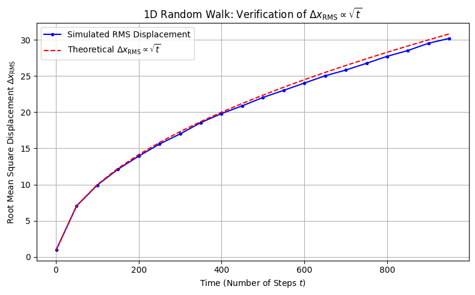
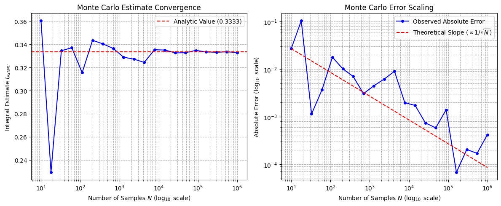

# **Chapter 17: Randomness in Physics (Codebook)**

---

This Codebook implements the final pillar of the computational toolkit: **Stochastic Methods**. We demonstrate the **Random Walk** as a microscopic model for diffusion and use **Monte Carlo Integration** to solve integrals with characteristic $1/\sqrt{N}$ convergence.

---

## Project 1: The Random Walk (Microscopic Diffusion)

| Component | Description |
| :--- | :--- |
| **Objective** | Simulate 5000 random walkers to verify $\Delta x_{\text{RMS}} \propto \sqrt{t}$. |
| **Mathematical Concept** | Microscopic stochastic process; ensemble averaging. |
| **Experiment Setup** | 1000 step walks; $\pm 1$ step size; seed-locked PRNG. |
| **Expected Behavior** | RMS displacement grows linearly with the square root of time. |
| **Verification Goal** | Match the simulated growth rate to the theoretical $\sqrt{t}$ curve. |

---

### Complete Python Code

```python

import numpy as np
import matplotlib.pyplot as plt

# Set a seed for reproducibility (a core principle of PRNGs)

np.random.seed(42)

## ==========================================================

# **Chapter 17: Randomness in Physics () () (Codebook)**

## Project 1: The Random Walk (Microscopic Diffusion)

## ==========================================================

## ==========================================================

## 1. Setup Parameters

## ==========================================================

N_STEPS = 1000       # Total steps in each walk (time t)
N_WALKERS = 5000     # Number of walkers (ensemble average)

## Time points to record the RMS displacement

time_indices = np.arange(0, N_STEPS, 50)
time_indices[0] = 1 # Start from step 1 to avoid log(0) issues

## ==========================================================

## 2. Simulate the Random Walk Ensemble

## ==========================================================

## Array to store the final positions of all walkers after N_STEPS

final_positions = np.zeros(N_WALKERS)

## Array to store the squared displacement (x²) over time, averaged across walkers

mean_sq_displacement_history = np.zeros(len(time_indices))

## Loop over the ensemble of walkers

for w in range(N_WALKERS):
    # Steps array: +1 or -1
    # np.random.choice([1, -1], size=N_STEPS) efficiently generates the steps
    steps = np.random.choice([1, -1], size=N_STEPS)

    # Calculate the cumulative displacement (position x) over time
    positions = np.cumsum(steps)
    final_positions[w] = positions[-1]

    # Store the square of the displacement for the RMS average
    for i, t_idx in enumerate(time_indices):
        mean_sq_displacement_history[i] += positions[t_idx - 1]**2

## Calculate the ensemble average: divide the sum of squares by the number of walkers

mean_sq_displacement_history /= N_WALKERS

## Calculate the Root Mean Square (RMS) displacement

rms_displacement_history = np.sqrt(mean_sq_displacement_history)

## ==========================================================

## 3. Visualization and Analysis (Verifying the sqrt(t) law)

## ==========================================================

fig, ax = plt.subplots(figsize=(8, 5))

## Plot the computed RMS displacement

ax.plot(time_indices, rms_displacement_history, 'b-o', markersize=3, label="Simulated RMS Displacement")

## Plot the theoretical prediction: RMS ∝ sqrt(t)

## Theory: RMS = sqrt(t), so we plot y = sqrt(x)

ax.plot(time_indices, np.sqrt(time_indices), 'r--', label=r"Theoretical $\Delta x_{\text{RMS}} \propto \sqrt{t}$")

ax.set_title(r"1D Random Walk: Verification of $\Delta x_{\text{RMS}} \propto \sqrt{t}$")
ax.set_xlabel("Time (Number of Steps $t$)")
ax.set_ylabel(r"Root Mean Square Displacement $\Delta x_{\text{RMS}}$")
ax.grid(True)
ax.legend()
plt.tight_layout()
plt.show()

## ==========================================================

## 4. Analysis Output

## ==========================================================

## Final check of the predicted vs. observed relationship

final_t = time_indices[-1]
final_rms_observed = rms_displacement_history[-1]
final_rms_theoretical = np.sqrt(final_t)

print("\n--- Random Walk Analysis Summary ---")
print(f"Total Walkers Simulated: {N_WALKERS}")
print(f"Total Steps (t_final): {final_t}")
print("-" * 40)
print(f"Observed Final RMS Displacement: {final_rms_observed:.4f}")
print(f"Theoretical Final RMS Displacement: {final_rms_theoretical:.4f}")
print(f"Relative Error: {np.abs(final_rms_observed - final_rms_theoretical) / final_rms_theoretical:.2e}")

print("\nConclusion: The simulation confirms the fundamental law of diffusion: the observed \nRMS displacement closely follows the square root of time, validating the random walk \nas a stochastic model for diffusion.")


```
**Sample Output:**
```python
--- Random Walk Analysis Summary ---
Total Walkers Simulated: 5000
Total Steps (t_final): 950

---

Observed Final RMS Displacement: 30.1974
Theoretical Final RMS Displacement: 30.8221
Relative Error: 2.03e-02

Conclusion: The simulation confirms the fundamental law of diffusion: the observed
RMS displacement closely follows the square root of time, validating the random walk
as a stochastic model for diffusion.
```





```
--- Random Walk Analysis Summary ---
Total Walkers Simulated: 5000
Total Steps (t_final): 950
----------------------------------------
Observed Final RMS Displacement: 30.1974
Theoretical Final RMS Displacement: 30.8221
Relative Error: 2.03e-02

Conclusion: The simulation confirms the fundamental law of diffusion: the observed
RMS displacement closely follows the square root of time, validating the random walk
as a stochastic model for diffusion.


```
## Project 2: Monte Carlo Integration (Area Under a Curve)

| Component | Description |
| :--- | :--- |
| **Objective** | Calculate $\int_0^1 x^2 dx$ using stochastic sampling. |
| **Mathematical Concept** | Mean Value Theorem: $I \approx (b-a) \cdot \frac{1}{N} \sum f(x_i)$. |
| **Experiment Setup** | Increasing $N$ from $10^1$ to $10^6$ to track convergence. |
| **Expected Behavior** | Error decreases as $1/\sqrt{N}$ (power law with slope -0.5). |
| **Verification Goal** | Demonstrate statistical convergence regardless of $N$ magnitude. |

---

### Complete Python Code

```python

import numpy as np
import matplotlib.pyplot as plt

## Set a seed for reproducibility

np.random.seed(42)

## ==========================================================

# **Chapter 17: Randomness in Physics () () (Codebook)**

## Project 2: Monte Carlo Integration (Area Under a Curve)

## ==========================================================

## ==========================================================

## 1. Setup Parameters and Test Function

## ==========================================================

I_ANALYTIC = 1.0 / 3.0  # True integral of x² from 0 to 1
DOMAIN_VOLUME = 1.0     # Volume of the integration domain (1 - 0 = 1)

def f(x):
    """The function to integrate: f(x) = x²."""
    return x**2

## Test a range of increasing sample sizes (N) to show convergence

N_SAMPLES_RANGE = np.logspace(1, 6, 20, dtype=int)

## ==========================================================

## 2. Perform Monte Carlo Integration

## ==========================================================

monte_carlo_estimates = []
absolute_errors = []

for N in N_SAMPLES_RANGE:
    # 1. Generate random sample points (Uniform distribution in [0, 1])
    x_samples = np.random.rand(N)

    # 2. Evaluate the function at the random points
    f_samples = f(x_samples)

    # 3. Calculate the average function value
    f_average = np.mean(f_samples)

    # 4. Monte Carlo Estimate: I ≈ Volume * <f>
    I_mc = DOMAIN_VOLUME * f_average

    monte_carlo_estimates.append(I_mc)
    absolute_errors.append(np.abs(I_mc - I_ANALYTIC))

## ==========================================================

## 3. Visualization and Analysis (Verifying the 1/sqrt(N) law)

## ==========================================================

fig, ax = plt.subplots(1, 2, figsize=(12, 5))

## --- Plot 1: Convergence of Estimate ---

ax[0].semilogx(N_SAMPLES_RANGE, monte_carlo_estimates, 'b-o', markersize=4)
ax[0].axhline(I_ANALYTIC, color='r', linestyle='--', label=f"Analytic Value ({I_ANALYTIC:.4f})")

ax[0].set_title("Monte Carlo Estimate Convergence")
ax[0].set_xlabel("Number of Samples $N$ ($\log_{10}$ scale)")
ax[0].set_ylabel("Integral Estimate $I_{\text{MC}}$")
ax[0].grid(True, which="both", ls="--")
ax[0].legend()

## --- Plot 2: Error Analysis (Verifying 1/sqrt(N)) ---

## The error plot confirms the scaling rate.

ax[1].loglog(N_SAMPLES_RANGE, absolute_errors, 'b-o', markersize=4, label="Observed Absolute Error")

## Plot the theoretical guide: Error ∝ 1/sqrt(N) → slope = -0.5

## We use the first point to scale the theoretical guide line

E0 = absolute_errors[0]
N0 = N_SAMPLES_RANGE[0]
theoretical_error_guide = E0 * np.sqrt(N0) / np.sqrt(N_SAMPLES_RANGE)

ax[1].loglog(N_SAMPLES_RANGE, theoretical_error_guide, 'r--', label=r"Theoretical Slope ($\propto 1/\sqrt{N}$)")

ax[1].set_title("Monte Carlo Error Scaling")
ax[1].set_xlabel("Number of Samples $N$ ($\log_{10}$ scale)")
ax[1].set_ylabel("Absolute Error ($\log_{10}$ scale)")
ax[1].grid(True, which="both", ls="--")
ax[1].legend()

plt.tight_layout()
plt.show()

## ==========================================================

## 4. Analysis Output

## ==========================================================

final_N = N_SAMPLES_RANGE[-1]
final_I_mc = monte_carlo_estimates[-1]
final_error = absolute_errors[-1]

print("\n--- Monte Carlo Integration Summary ---")
print(f"Analytic Value (I_true): {I_ANALYTIC:.6f}")
print(f"Final Samples (N): {final_N}")
print("-" * 50)
print(f"Final Monte Carlo Estimate: {final_I_mc:.6f}")
print(f"Final Absolute Error: {final_error:.2e}")

print("\nConclusion: The estimate converges to the true value, and the error plot confirms the \ncharacteristic $1/\sqrt{N}$ scaling. This proves the feasibility of Monte Carlo methods for high-dimensional integration.")

```
**Sample Output:**
```python
--- Monte Carlo Integration Summary ---
Analytic Value (I_true): 0.333333
Final Samples (N): 1000000

---

Final Monte Carlo Estimate: 0.332914
Final Absolute Error: 4.19e-04

Conclusion: The estimate converges to the true value, and the error plot confirms the
characteristic $1/\sqrt{N}$ scaling. This proves the feasibility of Monte Carlo methods for high-dimensional integration.
```





```
--- Monte Carlo Integration Summary ---
Analytic Value (I_true): 0.333333
Final Samples (N): 1000000
--------------------------------------------------
Final Monte Carlo Estimate: 0.332914
Final Absolute Error: 4.19e-04

Conclusion: The estimate converges to the true value, and the error plot confirms the
characteristic $1/\sqrt{N}$ scaling. This proves the feasibility of Monte Carlo methods for high-dimensional integration.
```