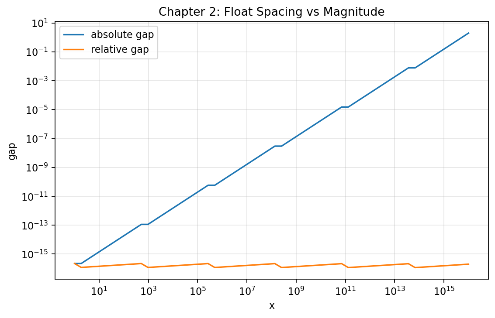
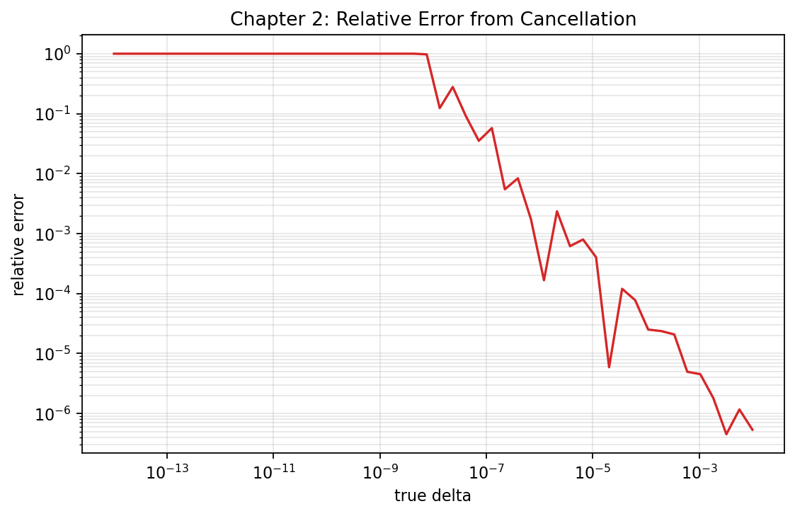
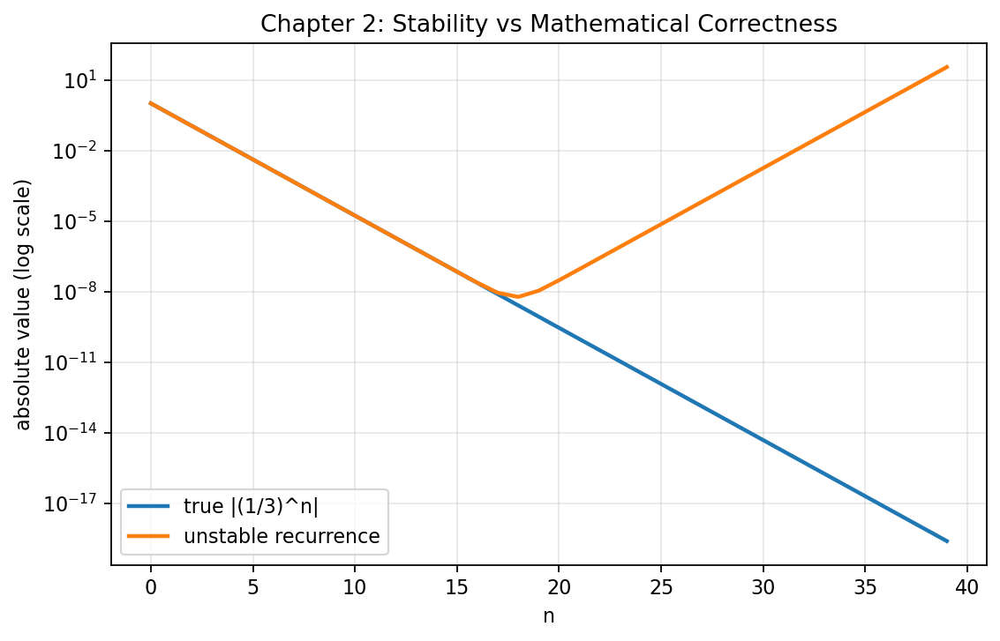

# **Chapter 2: End-to-End Numerical Reliability Workflow () () (Codebook)**

---

## Project Scope

This codebook executes a complete Chapter 2 workflow using reproducible scripts and chapter-local artifacts.

Expected outputs in this chapter:

- `codes/ch2_gap_scaling.png`
- `codes/ch2_cancellation_error.png`
- `codes/ch2_stability_recurrence.png`

---

## Step 1: Representation and Epsilon Baseline

```python
import numpy as np

print("=== Chapter 2 Baseline ===")
print("float64 epsilon:", np.finfo(np.float64).eps)
print("0.1 as stored:", format(np.float64(0.1), ".55f"))
print("0.1 + 0.2:", np.float64(0.1) + np.float64(0.2))
print("0.3:", np.float64(0.3))
print("equality check:", (np.float64(0.1) + np.float64(0.2)) == np.float64(0.3))
```
**Sample Output:**
```python
=== Chapter 2 Baseline ===
float64 epsilon: 2.220446049250313e-16
0.1 as stored: 0.1000000000000000055511151231257827021181583404541015625
0.1 + 0.2: 0.30000000000000004
0.3: 0.3
equality check: False
```


Interpretation:

- Representation is approximate from the first assignment.
- Equality checks on decimal fractions can fail despite mathematically correct intent.

---

## Step 2: Gap Scaling Experiment (with Plot)

```python
from pathlib import Path
import numpy as np
import matplotlib.pyplot as plt

codes_dir = Path("docs/chapters/chapter-2/codes")
codes_dir.mkdir(parents=True, exist_ok=True)

x = np.logspace(0, 16, 60)
next_x = np.nextafter(x, np.inf)
abs_gap = next_x - x
rel_gap = abs_gap / x

fig, ax = plt.subplots(figsize=(8, 4.8))
ax.loglog(x, abs_gap, label="absolute gap")
ax.loglog(x, rel_gap, label="relative gap")
ax.set_title("Chapter 2: Float Spacing vs Magnitude")
ax.set_xlabel("x")
ax.set_ylabel("gap")
ax.grid(True, which="both", alpha=0.3)
ax.legend()

out_file = codes_dir / "ch2_gap_scaling.png"
fig.savefig(out_file, dpi=160, bbox_inches="tight")
plt.close(fig)

print(f"Saved figure to: {out_file}")
print("Median relative gap:", float(np.median(rel_gap)))
```



---

## Step 3: Catastrophic Cancellation Experiment (with Plot)

```python
from pathlib import Path
import numpy as np
import matplotlib.pyplot as plt

codes_dir = Path("docs/chapters/chapter-2/codes")
codes_dir.mkdir(parents=True, exist_ok=True)

x = np.float64(1e8)
delta = np.logspace(-2, -14, 50)
recovered = (x + delta) - x
rel_err = np.abs(recovered - delta) / delta

fig, ax = plt.subplots(figsize=(8, 4.8))
ax.loglog(delta, rel_err, color="tab:red")
ax.set_title("Chapter 2: Relative Error from Cancellation")
ax.set_xlabel("true delta")
ax.set_ylabel("relative error")
ax.grid(True, which="both", alpha=0.3)

out_file = codes_dir / "ch2_cancellation_error.png"
fig.savefig(out_file, dpi=160, bbox_inches="tight")
plt.close(fig)

print(f"Saved figure to: {out_file}")
print("Worst relative error:", float(np.max(rel_err)))
```



---

## Step 4: Stability Demonstration via Recurrence (with Plot)

This example contrasts a stable forward recurrence with an unstable one.

```python
from pathlib import Path
import numpy as np
import matplotlib.pyplot as plt

codes_dir = Path("docs/chapters/chapter-2/codes")
codes_dir.mkdir(parents=True, exist_ok=True)

n = np.arange(0, 40)
true_y = (1.0 / 3.0) ** n

## Unstable recurrence: y_n = (10/3) y_{n-1} - y_{n-2}

unstable = np.zeros_like(true_y)
unstable[0] = 1.0
unstable[1] = 1.0 / 3.0
for k in range(2, len(n)):
    unstable[k] = (10.0 / 3.0) * unstable[k - 1] - unstable[k - 2]

fig, ax = plt.subplots(figsize=(8, 4.8))
ax.semilogy(n, np.abs(true_y), label="true |(1/3)^n|", linewidth=2)
ax.semilogy(n, np.abs(unstable), label="unstable recurrence", linewidth=2)
ax.set_title("Chapter 2: Stability vs Mathematical Correctness")
ax.set_xlabel("n")
ax.set_ylabel("absolute value (log scale)")
ax.grid(True, alpha=0.3)
ax.legend()

out_file = codes_dir / "ch2_stability_recurrence.png"
fig.savefig(out_file, dpi=160, bbox_inches="tight")
plt.close(fig)

print(f"Saved figure to: {out_file}")
print("Final true value:", float(true_y[-1]))
print("Final unstable value:", float(unstable[-1]))
```



---

## Step 5: Professional Reproducibility Checklist

1. Scripts run top-to-bottom without manual patching.
2. All generated assets are in this chapter's `codes` folder.
3. Every figure has title, labels, and grid.
4. Numerical claims are tied to printed metrics.

---

## Step 6: Git Snapshot

```python
git add docs/chapters/chapter-2/essay.md
git add docs/chapters/chapter-2/workbook.md
git add docs/chapters/chapter-2/codebook.md
git add docs/chapters/chapter-2/codes/ch2_gap_scaling.png
git add docs/chapters/chapter-2/codes/ch2_cancellation_error.png
git add docs/chapters/chapter-2/codes/ch2_stability_recurrence.png
git commit -m "Chapter 2: polish pedagogy and add reproducible codebook artifacts"
```

---

## Bridge

With Chapter 2 complete, we now have the numerical safety mindset required for Chapter 3: building approximation methods while tracking accuracy and stability explicitly.