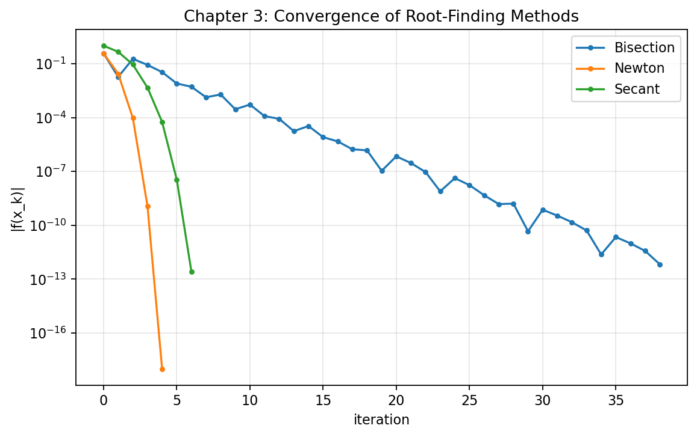
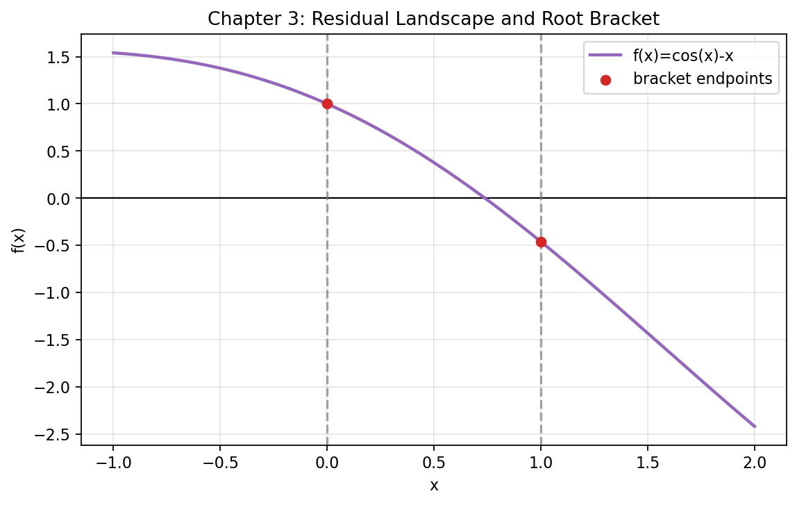
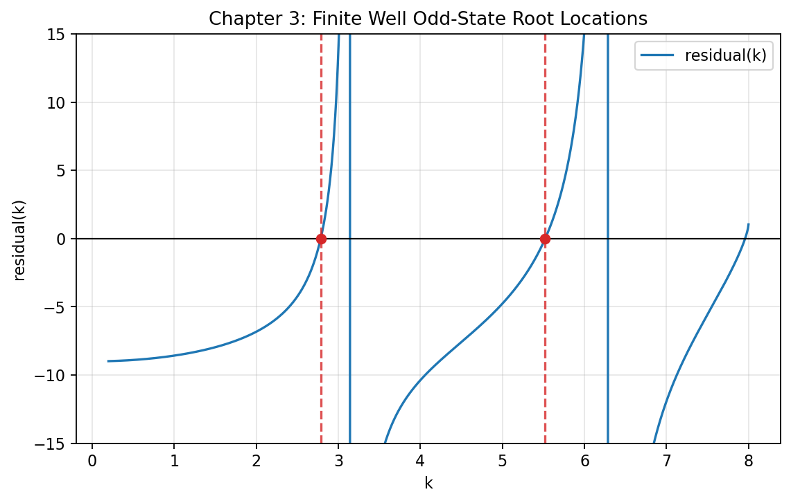

# **Chapter 3: End-to-End Root-Finding Practice (Codebook)**

---

## Project Scope

This codebook provides production-style root-finding workflows with validation and visualization.

Generated artifacts in this chapter:

- `codes/ch3_method_convergence.png`
- `codes/ch3_residual_landscape.png`
- `codes/ch3_finite_well_roots.png`

---

## Step 1: Solver Implementations (Bisection, Newton, Secant)

```python
import numpy as np


def bisection(f, a, b, tol_x=1e-12, tol_f=1e-12, max_iter=200):
    fa, fb = f(a), f(b)
    if fa * fb > 0:
        raise ValueError("Bisection requires a sign-change bracket.")

    hist = []
    x_old = None
    for i in range(max_iter):
        x = 0.5 * (a + b)
        fx = f(x)
        dx = np.nan if x_old is None else abs(x - x_old)
        hist.append((i, x, fx, dx))

        if abs(fx) < tol_f:
            return x, hist, "residual"
        if x_old is not None and abs(x - x_old) < tol_x:
            return x, hist, "step"

        if fa * fx < 0:
            b, fb = x, fx
        else:
            a, fa = x, fx

        x_old = x

    return x, hist, "max_iter"


def newton(f, df, x0, tol_x=1e-12, tol_f=1e-12, max_iter=100):
    hist = []
    x = x0
    x_old = None

    for i in range(max_iter):
        fx = f(x)
        dfx = df(x)
        dx = np.nan if x_old is None else abs(x - x_old)
        hist.append((i, x, fx, dx))

        if abs(fx) < tol_f:
            return x, hist, "residual"
        if x_old is not None and abs(x - x_old) < tol_x:
            return x, hist, "step"

        if abs(dfx) < 1e-14:
            return x, hist, "derivative_floor"

        x_old = x
        x = x - fx / dfx

    return x, hist, "max_iter"


def secant(f, x0, x1, tol_x=1e-12, tol_f=1e-12, max_iter=100):
    f0, f1 = f(x0), f(x1)
    hist = [(0, x0, f0, np.nan), (1, x1, f1, abs(x1 - x0))]

    for i in range(2, max_iter + 1):
        denom = (f1 - f0)
        if abs(denom) < 1e-16:
            return x1, hist, "secant_breakdown"

        x2 = x1 - f1 * (x1 - x0) / denom
        f2 = f(x2)
        hist.append((i, x2, f2, abs(x2 - x1)))

        if abs(f2) < tol_f:
            return x2, hist, "residual"
        if abs(x2 - x1) < tol_x:
            return x2, hist, "step"

        x0, f0 = x1, f1
        x1, f1 = x2, f2

    return x1, hist, "max_iter"
```

---

## Step 2: Convergence Comparison on a Benchmark Residual

Residual:

$$
f(x) = \cos(x) - x
$$

```python
from pathlib import Path
import numpy as np
import matplotlib.pyplot as plt

codes_dir = Path("docs/chapters/chapter-3/codes")
codes_dir.mkdir(parents=True, exist_ok=True)


def bisection(f, a, b, tol_x=1e-12, tol_f=1e-12, max_iter=200):
    fa, fb = f(a), f(b)
    if fa * fb > 0:
        raise ValueError("Bisection requires a sign-change bracket.")

    hist = []
    x_old = None
    for i in range(max_iter):
        x = 0.5 * (a + b)
        fx = f(x)
        dx = np.nan if x_old is None else abs(x - x_old)
        hist.append((i, x, fx, dx))

        if abs(fx) < tol_f:
            return x, hist, "residual"
        if x_old is not None and abs(x - x_old) < tol_x:
            return x, hist, "step"

        if fa * fx < 0:
            b, fb = x, fx
        else:
            a, fa = x, fx

        x_old = x

    return x, hist, "max_iter"


def newton(f, df, x0, tol_x=1e-12, tol_f=1e-12, max_iter=100):
    hist = []
    x = x0
    x_old = None

    for i in range(max_iter):
        fx = f(x)
        dfx = df(x)
        dx = np.nan if x_old is None else abs(x - x_old)
        hist.append((i, x, fx, dx))

        if abs(fx) < tol_f:
            return x, hist, "residual"
        if x_old is not None and abs(x - x_old) < tol_x:
            return x, hist, "step"

        if abs(dfx) < 1e-14:
            return x, hist, "derivative_floor"

        x_old = x
        x = x - fx / dfx

    return x, hist, "max_iter"


def secant(f, x0, x1, tol_x=1e-12, tol_f=1e-12, max_iter=100):
    f0, f1 = f(x0), f(x1)
    hist = [(0, x0, f0, np.nan), (1, x1, f1, abs(x1 - x0))]

    for i in range(2, max_iter + 1):
        denom = (f1 - f0)
        if abs(denom) < 1e-16:
            return x1, hist, "secant_breakdown"

        x2 = x1 - f1 * (x1 - x0) / denom
        f2 = f(x2)
        hist.append((i, x2, f2, abs(x2 - x1)))

        if abs(f2) < tol_f:
            return x2, hist, "residual"
        if abs(x2 - x1) < tol_x:
            return x2, hist, "step"

        x0, f0 = x1, f1
        x1, f1 = x2, f2

    return x1, hist, "max_iter"


def f(x):
    return np.cos(x) - x


def df(x):
    return -np.sin(x) - 1.0

r_b, h_b, t_b = bisection(f, 0.0, 1.0)
r_n, h_n, t_n = newton(f, df, 0.5)
r_s, h_s, t_s = secant(f, 0.0, 1.0)

print("Bisection root:", r_b, "termination:", t_b, "iters:", len(h_b))
print("Newton root:", r_n, "termination:", t_n, "iters:", len(h_n))
print("Secant root:", r_s, "termination:", t_s, "iters:", len(h_s))

fig, ax = plt.subplots(figsize=(8.2, 4.8))

for name, hist, color in [
    ("Bisection", h_b, "tab:blue"),
    ("Newton", h_n, "tab:orange"),
    ("Secant", h_s, "tab:green"),
]:
    k = np.array([row[0] for row in hist], dtype=float)
    r = np.array([abs(row[2]) for row in hist], dtype=float)
    r = np.maximum(r, 1e-18)
    ax.semilogy(k, r, marker="o", linewidth=1.5, markersize=3, label=name, color=color)

ax.set_title("Chapter 3: Convergence of Root-Finding Methods")
ax.set_xlabel("iteration")
ax.set_ylabel("|f(x_k)|")
ax.grid(True, which="both", alpha=0.3)
ax.legend()

out_file = codes_dir / "ch3_method_convergence.png"
fig.savefig(out_file, dpi=160, bbox_inches="tight")
plt.close(fig)

print(f"Saved figure to: {out_file}")
```



---

## Step 3: Residual Landscape and Bracket Diagnostics

```python
from pathlib import Path
import numpy as np
import matplotlib.pyplot as plt

codes_dir = Path("docs/chapters/chapter-3/codes")
codes_dir.mkdir(parents=True, exist_ok=True)


def f(x):
    return np.cos(x) - x

x = np.linspace(-1.0, 2.0, 600)
y = f(x)

fig, ax = plt.subplots(figsize=(8.2, 4.8))
ax.axhline(0.0, color="black", linewidth=1.0)
ax.plot(x, y, color="tab:purple", linewidth=2.0, label="f(x)=cos(x)-x")

## Show example bracket used by bisection

ax.axvline(0.0, linestyle="--", color="tab:gray", alpha=0.7)
ax.axvline(1.0, linestyle="--", color="tab:gray", alpha=0.7)
ax.scatter([0.0, 1.0], [f(0.0), f(1.0)], color="tab:red", zorder=3, label="bracket endpoints")

ax.set_title("Chapter 3: Residual Landscape and Root Bracket")
ax.set_xlabel("x")
ax.set_ylabel("f(x)")
ax.grid(True, alpha=0.3)
ax.legend()

out_file = codes_dir / "ch3_residual_landscape.png"
fig.savefig(out_file, dpi=160, bbox_inches="tight")
plt.close(fig)

print(f"Saved figure to: {out_file}")
```



---

## Step 4: Finite Square Well Odd-State Roots

For one normalized odd-state formulation, solve:

$$
-k \cot(k) - \sqrt{\alpha^2 - k^2} = 0, \quad 0<k<\alpha
$$

```python
from pathlib import Path
import numpy as np
import matplotlib.pyplot as plt

codes_dir = Path("docs/chapters/chapter-3/codes")
codes_dir.mkdir(parents=True, exist_ok=True)

ALPHA = 8.0


def residual(k):
    return -k * (np.cos(k) / np.sin(k)) - np.sqrt(np.maximum(ALPHA ** 2 - k ** 2, 0.0))


def bisection_local(f, a, b, tol=1e-12, max_iter=200):
    fa, fb = f(a), f(b)
    if fa * fb > 0:
        raise ValueError("Invalid bracket")
    for _ in range(max_iter):
        m = 0.5 * (a + b)
        fm = f(m)
        if abs(fm) < tol or abs(b - a) < tol:
            return m
        if fa * fm < 0:
            b, fb = m, fm
        else:
            a, fa = m, fm
    return 0.5 * (a + b)

## Build candidate brackets away from singular points n*pi

eps = 1e-3
candidates = [
    (0.5 * np.pi + eps, np.pi - eps),
    (1.5 * np.pi + eps, 2.0 * np.pi - eps),
]

roots = []
for a, b in candidates:
    if b >= ALPHA:
        continue
    fa, fb = residual(a), residual(b)
    if np.isfinite(fa) and np.isfinite(fb) and fa * fb < 0:
        roots.append(bisection_local(residual, a, b))

print("Odd-state k roots:", roots)

x = np.linspace(0.2, ALPHA - 1e-3, 1500)
y = residual(x)

fig, ax = plt.subplots(figsize=(8.2, 4.8))
ax.plot(x, y, color="tab:blue", linewidth=1.5, label="residual(k)")
ax.axhline(0.0, color="black", linewidth=1.0)

for r in roots:
    ax.axvline(r, linestyle="--", color="tab:red", alpha=0.8)
    ax.scatter([r], [0.0], color="tab:red", zorder=3)

ax.set_ylim(-15, 15)
ax.set_title("Chapter 3: Finite Well Odd-State Root Locations")
ax.set_xlabel("k")
ax.set_ylabel("residual(k)")
ax.grid(True, alpha=0.3)
ax.legend()

out_file = codes_dir / "ch3_finite_well_roots.png"
fig.savefig(out_file, dpi=160, bbox_inches="tight")
plt.close(fig)

print(f"Saved figure to: {out_file}")
```



---

## Step 5: Professional Validation Checklist

1. Residual formulation is stated and unit-consistent.
2. Brackets/initial guesses are documented and justified.
3. Termination reason is logged, not assumed.
4. At least two convergence metrics are inspected.
5. Root values are cross-checked against physical constraints.

---

## Step 6: Git Snapshot

```python
git add docs/chapters/chapter-3/essay.md
git add docs/chapters/chapter-3/workbook.md
git add docs/chapters/chapter-3/codebook.md
git add docs/chapters/chapter-3/codes/ch3_method_convergence.png
git add docs/chapters/chapter-3/codes/ch3_residual_landscape.png
git add docs/chapters/chapter-3/codes/ch3_finite_well_roots.png
git commit -m "Chapter 3: full pedagogical rewrite with professional codebook outputs"
```

---

## Bridge

Chapter 3 established robust nonlinear solving practice. Chapter 4 will extend this rigor to interpolation and approximation, where representation choices and model structure determine predictive quality.