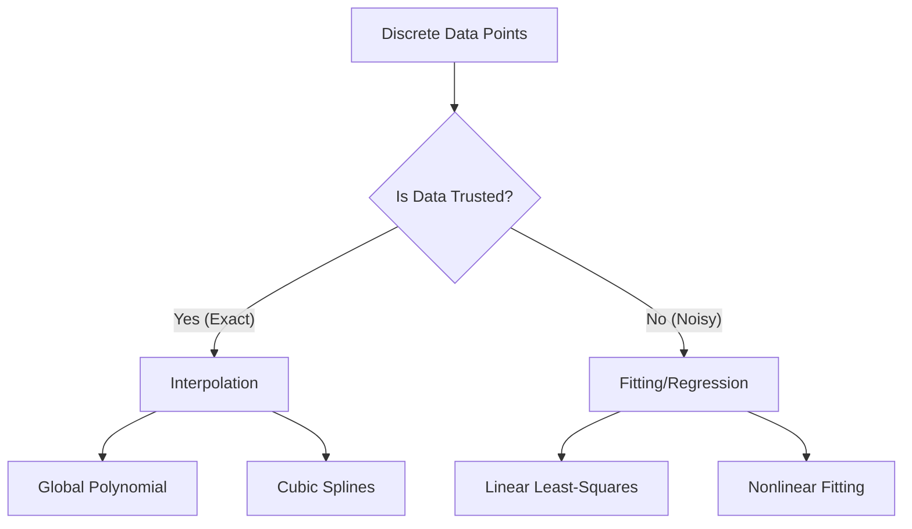

# **Chapter 4: Interpolation and Fitting**

---

# **Introduction**

In the "Digital Lab," we rarely possess a continuous, analytical formula for every physical process. Instead, we often work with discrete sets of "observations"—individual data points $(\mathbf{x}_i, \mathbf{y}_i)$ collected from experiments, sensors, or sparse simulations. To make predictions or understand the underlying physics, we must bridge the gaps between these points.

This chapter defines the two fundamental strategies for modeling discrete data: **Interpolation** and **Fitting**. While they share similar mathematical machinery, they represent two distinct scientific goals. Interpolation seeks an exact path through every trusted data point, while Fitting seeks the most likely "trend" through noisy observations. Understanding the trade-offs between global and local models—and the dangers of **Runge's Phenomenon**—is essential for building data-driven models that are physically plausible and numerically stable.

---

# **Chapter 4: Outline**

| **Sec.** | **Title** | **Core Ideas & Examples** |
| :--- | :--- | :--- |
| **4.1** | **Modeling Strategy: Exact vs. Trend** | Interpolation (matching points) vs. Fitting (minimizing error); the role of noise; decision criteria. |
| **4.2** | **Polynomial Interpolation** | Lagrange and Newton forms; uniqueness of polynomials; the $N+1$ points for $N$-degree rule. |
| **4.3** | **Runge's Phenomenon** | The hidden danger of high-degree polynomials; edge oscillations; the need for local models. |
| **4.4** | **Cubic Splines (Local Wisdom)** | Piecewise polynomials; ensuring continuity of $f(x)$, $f'(x)$, and $f''(x)$; natural vs. clamped boundaries. |
| **4.5** | **Least-Squares Fitting** | Minimizing the sum of squared residuals ($L_2$ norm); linear regression; the normal equations. |
| **4.6** | **Standard Practice: Goodness of Fit** | Residual analysis; Coefficient of Determination ($R^2$); avoiding the "Overfitting" trap. |

---

## **4.1 Modeling Strategy: Exact vs. Trend**

---

Before selecting an algorithm, you must identify the nature of your data:

1.  **Interpolation:** Used when your data points are **exact** (e.g., values from a known lookup table). The goal is to find a function $P(x)$ such that $P(x_i) = y_i$ for every point.
2.  **Fitting (Regession):** Used when your data contains **noise** or uncertainty (e.g., sensor readings). The goal is to find a function that passes *near* the points to capture the overall trend, without being distracted by random fluctuations.

!!! tip "Interpolation vs. Fitting"
    If you interpolate noisy data, you are accurately modeling the noise, not the physics. If you fit exact data, you are intentionally throwing away precision. Always match the tool to the data's integrity.

---

## **4.2 Polynomial Interpolation & Runge's Phenomenon**

---

Mathematically, for any $N+1$ points with distinct $x$-coordinates, there exists a **unique** polynomial of degree $N$ that passes through all of them.

While Lagrange polynomials provide a beautiful theoretical form, they suffer from a practical catastrophe known as **Runge's Phenomenon**: as the degree of the polynomial increases, the function begins to oscillate wildly near the edges of the interval.

!!! example "Runge's Phenomenon"
    Consider the function $f(x) = \frac{1}{1 + 25x^2}$ (the Runge function). If you try to interpolate this with a 10th-degree polynomial on evenly spaced points, the error at the boundaries grows to over 100%, even though it matches the central points perfectly. **High-degree polynomials are numerically unstable for global interpolation.**

---

## **4.3 Cubic Splines: Local Wisdom**

---

To avoid the oscillations of high-degree polynomials, we use **Cubic Splines**. Instead of one giant polynomial for the whole domain, we use a different cubic polynomial for every interval $[x_i, x_{i+1}]$.

To make the transition between intervals looks "natural," we enforce three physical constraints at every internal point (knot):
1.  **Continuity of Value:** The two polynomials must meet at the point.
2.  **Continuity of Slope:** The first derivatives must match ($C^1$ continuity).
3.  **Continuity of Curvature:** The second derivatives must match ($C^2$ continuity).

!!! tip "The Spline Advantage"
    Splines are the "Standard" for smooth data reconstruction. Because they are local, a "spike" in one data point only affects the nearby segments, preventing the global instability found in Lagrange polynomials.

---

## **4.4 Least-Squares Fitting**

---

When fitting noisy data, we seek a "Best Fit" $f(x; \beta)$ that minimizes the total distance from the data points. The most common metric is the **Least-Squares** objective:

$$ \text{Minimize } S = \sum_{i=1}^{N} [y_i - f(x_i; \beta)]^2 $$

For a linear model $y = mx + b$, this leads to a set of **Normal Equations** that can be solved exactly using linear algebra.

??? question "Why minimize the square of the error?"
    Minimizing the square (rather than the absolute value) penalizes large "outliers" more heavily and provides a smooth objective function that is easy to differentiate and optimize using calculus.

---

## **4.5 Standard Practice: Goodness of Fit**

---

How do you know if your model is good? A professional "Standard" requires checking the **Residuals**:

$$ \text{Residual}_i = y_i (\text{observed}) - y_i (\text{predicted}) $$

- **Good Fit:** Residuals should look like "white noise"—random, centered around zero, and with no visible patterns.
- **Bad Fit:** If the residuals show a curve (e.g., a "U-shape"), your model is missing a physical effect (e.g., you used a line to fit a parabola).

!!! example "The Overfitting Trap"
    If you use a 10th-degree polynomial to fit 11 noisy points, your error will be zero at those points ($r^2 = 1.0$), but the model will be useless for prediction. This is **Overfitting**: you have "memorized" the noise rather than learning the trend.

---

## **Summary: Interpolation vs. Fitting Comparison**

---

| Feature | Interpolation | Fitting (Least-Squares) |
| :--- | :--- | :--- |
| **Goal** | Exact Point Matching | Error Minimization (Trend) |
| **Passes Through Points?** | **Always** | **Rarely** |
| **Ideal Data** | High-precision / Deterministic | Low-precision / Noisy |
| **Failure Mode** | Oscillations (Runge's) | Overfitting (Too many params) |
| **Best Method** | **Cubic Splines** | **Low-degree Polynomials** |

---

## **References**

---

[1] Trefethen, L. N. (2013). *Approximation Theory and Approximation Practice*. SIAM.

[2] de Boor, C. (1978). *A Practical Guide to Splines*. Springer-Verlag.

[3] Burden, R. L., & Faires, J. D. (2011). *Numerical Analysis*. Brooks/Cole.

[4] Hastie, T., Tibshirani, R., & Friedman, J. (2009). *The Elements of Statistical Learning*. Springer.

[5] Björck, Å. (1996). *Numerical Methods for Least Squares Problems*. SIAM.