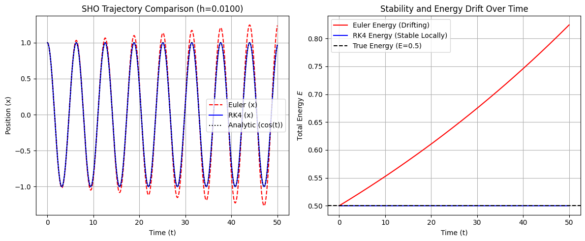
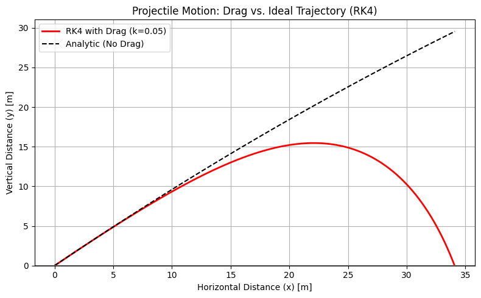

# **Chapter 7: Initial Value Problems I (Codebook)**

---

This Codebook provides the baseline implementations for solving **Initial Value Problems (IVPs)**. We Implement **Euler's Method** and **RK4**, focusing on their performance for the Simple Harmonic Oscillator and nonlinear projectile motion with air resistance.

---

## Project 1: Accuracy and Stability Showdown (Euler vs. RK4)

| Component | Description |
| :--- | :--- |
| **Objective** | Compare the stability of **Euler's Method** ($O(h)$) vs. **RK4** ($O(h^4)$) using the Simple Harmonic Oscillator (SHO). |
| **Mathematical Concept** | Solving $\mathbf{S}' = [v, -x]$; energy $E = \frac{1}{2}(v^2 + x^2)$ should be constant in the exact solution. |
| **Experiment Setup** | Python, NumPy for step-by-step vector iteration; simulation time $t \in [0, 50]$. |
| **Expected Behavior** | Euler's method should spirally diverge (energy injection), while RK4 remains stable on this timescale. |
| **Verification Goal** | Demonstrate why high-order methods are essential for orbital/oscillatory stability. |

---

### Complete Python Code

```python
import numpy as np
import matplotlib.pyplot as plt

# ==========================================================

# **Chapter 7: Initial Value Problems I () () (Codebook)**

## Project 1: Accuracy and Stability Showdown (Euler vs. RK4)

## ==========================================================

## ==========================================================

## 1. Define Model (Simple Harmonic Oscillator)

## ==========================================================

def sho_deriv(t, S):
    """
    Derivative function for the Simple Harmonic Oscillator (x'' = -x).
    S = [x, v], S' = [v, -x]
    """
    x, v = S
    # dx/dt = v, dv/dt = -x
    return np.array([v, -x])

def sho_energy(S):
    """Calculates the total energy: E = 1/2 * (v^2 + x^2) (assuming m=k=1)."""
    x, v = S
    return 0.5 * (v**2 + x**2)

## Initial conditions and parameters

S0 = np.array([1.0, 0.0]) # Initial state: x(0)=1, v(0)=0
T_FINAL = 50.0            # Simulate for 50 periods (t=0 to 50)
N_STEPS = 5000            # Total number of steps
H = T_FINAL / N_STEPS     # Time step size (Δt)
T_GRID = np.linspace(0, T_FINAL, N_STEPS + 1)
E_TRUE = sho_energy(S0)   # True energy should be constant: 0.5 * (1^2 + 0^2) = 0.5

## ==========================================================

## 2. Implement Euler's Method (O(h) Accuracy)

## ==========================================================

def euler_solve(deriv_func, S0, h, N_steps):
    """Explicit Forward Euler integrator."""
    S = S0.copy()
    history = [S0.copy()]

    for _ in range(N_steps):
        S_prime = deriv_func(0, S) # t is ignored for autonomous system
        S += h * S_prime
        history.append(S.copy())
    return np.array(history)

## ==========================================================

## 3. Implement RK4 Method (O(h⁴) Accuracy)

## ==========================================================

def rk4_solve(deriv_func, S0, h, N_steps):
    """Explicit Fourth-Order Runge-Kutta integrator (RK4)."""
    S = S0.copy()
    history = [S0.copy()]

    for _ in range(N_steps):
        # Calculate four slopes (k1, k2, k3, k4)
        k1 = deriv_func(0, S)
        k2 = deriv_func(0, S + 0.5 * h * k1)
        k3 = deriv_func(0, S + 0.5 * h * k2)
        k4 = deriv_func(0, S + h * k3)

        # Apply weighted average (1/6, 2/6, 2/6, 1/6)
        S += (h / 6.0) * (k1 + 2*k2 + 2*k3 + k4)
        history.append(S.copy())
    return np.array(history)

## ==========================================================

## 4. Run Solvers and Compute Energy Histories

## ==========================================================

## Run Euler's Method

history_euler = euler_solve(sho_deriv, S0, H, N_STEPS)
E_euler = np.array([sho_energy(S) for S in history_euler])

## Run RK4 Method

history_rk4 = rk4_solve(sho_deriv, S0, H, N_STEPS)
E_rk4 = np.array([sho_energy(S) for S in history_rk4])

## ==========================================================

## 5. Visualization and Analysis

## ==========================================================

fig, ax = plt.subplots(1, 2, figsize=(12, 5))

## --- Plot 1: Trajectory (x vs. t) ---

ax[0].plot(T_GRID, history_euler[:, 0], 'r--', label="Euler (x)")
ax[0].plot(T_GRID, history_rk4[:, 0], 'b-', label="RK4 (x)")
ax[0].plot(T_GRID, np.cos(T_GRID), 'k:', label="Analytic (cos(t))")
ax[0].set_title(f"SHO Trajectory Comparison (h={H:.4f})")
ax[0].set_xlabel("Time (t)")
ax[0].set_ylabel("Position (x)")
ax[0].legend()
ax[0].grid(True)

## --- Plot 2: Total Energy (Stability Check) ---

ax[1].plot(T_GRID, E_euler, 'r-', label="Euler Energy (Drifting)")
ax[1].plot(T_GRID, E_rk4, 'b-', label="RK4 Energy (Stable Locally)")
ax[1].axhline(E_TRUE, color='k', linestyle='--', label=f"True Energy (E={E_TRUE})")
ax[1].set_title("Stability and Energy Drift Over Time")
ax[1].set_xlabel("Time (t)")
ax[1].set_ylabel(r"Total Energy $E$")
ax[1].grid(True)
ax[1].legend()

plt.tight_layout()
plt.show()

## ==========================================================

## 6. Analysis Output

## ==========================================================

print("\n--- Stability and Accuracy Analysis ---")
print(f"Time Step (h): {H:.4f}")
print(f"Total Simulation Time: {T_FINAL} s")
print("-" * 35)

## Measure final energy deviation

E_euler_dev = (E_euler[-1] - E_TRUE) / E_TRUE
E_rk4_dev = (E_rk4[-1] - E_TRUE) / E_TRUE

print("Euler Method:")
print(f"  Final Energy Deviation: {E_euler_dev * 100:.2f}% (Systematically Unstable)")

print("RK4 Method:")
print(f"  Final Energy Deviation: {E_rk4_dev * 100:.2f}% (Locally Accurate, but still small drift)")

print("\nConclusion: Euler's method systematically injects energy into the system, causing an \nexponential growth in amplitude and energy (instability). RK4 maintains high local \naccuracy and energy conservation over this timescale, demonstrating its superiority as \na general-purpose integrator.")

```
**Sample Output:**
```python
--- Stability and Accuracy Analysis ---
Time Step (h): 0.0100
Total Simulation Time: 50.0 s

---

Euler Method:
  Final Energy Deviation: 64.87% (Systematically Unstable)
RK4 Method:
  Final Energy Deviation: -0.00% (Locally Accurate, but still small drift)

Conclusion: Euler's method systematically injects energy into the system, causing an
exponential growth in amplitude and energy (instability). RK4 maintains high local
accuracy and energy conservation over this timescale, demonstrating its superiority as
a general-purpose integrator.
```





```
--- Stability and Accuracy Analysis ---
Time Step (h): 0.0100
Total Simulation Time: 50.0 s
-----------------------------------
Euler Method:
  Final Energy Deviation: 64.87% (Systematically Unstable)
RK4 Method:
  Final Energy Deviation: -0.00% (Locally Accurate, but still small drift)

Conclusion: Euler's method systematically injects energy into the system, causing an
exponential growth in amplitude and energy (instability). RK4 maintains high local
accuracy and energy conservation over this timescale, demonstrating its superiority as
a general-purpose integrator.


```
## Project 2: Coupled Systems — Projectile Motion with Drag

| Component | Description |
| :--- | :--- |
| **Objective** | Simulate **Projectile Motion with Quadratic Air Resistance (Drag)**. |
| **Mathematical Concept** | Force model: $\mathbf{r}''(t) = \mathbf{g} - (k/m)|\mathbf{v}|\mathbf{v}$. This is a 4D coupled system $(x, y, v_x, v_y)$. |
| **Experiment Setup** | RK4 integrator with a ground-strike stopping condition ($y < 0$). |
| **Expected Behavior** | Asymmetric trajectory; shorter range and lower height compared to the vacuum (parabolic) case. |
| **Verification Goal** | Successfully model a nonlinear, non-conservative physical system. |

---

### Complete Python Code

```python
import numpy as np
import matplotlib.pyplot as plt

## ==========================================================

# **Chapter 7: Initial Value Problems I () () (Codebook)**

## Project 2: Coupled Systems — Projectile Motion with Drag

## ==========================================================

## ==========================================================

## 1. Setup Parameters and 4D Derivative Function

## ==========================================================

## Physical parameters

G = 9.81              # Gravity (m/s²)
M = 1.0               # Mass (kg)
K_DRAG = 0.05         # Quadratic Drag Coefficient (k)

## Initial conditions

THETA_DEG = 45.0
V0 = 50.0             # Initial velocity (m/s)
V0X = V0 * np.cos(np.deg2rad(THETA_DEG))
V0Y = V0 * np.sin(np.deg2rad(THETA_DEG))

## State vector S = [x, y, vx, vy]

S0 = np.array([0.0, 0.0, V0X, V0Y])

def drag_deriv(t, S):
    """
    Derivative function for 4D coupled system: S' = [vx, vy, ax, ay].
    Drag force: F_d = -k * |v| * v
    """
    # Unpack state
    x, y, vx, vy = S

    # Velocity magnitude
    v_mag = np.sqrt(vx**2 + vy**2)

    # Calculate acceleration vector (a = F_net / m)

    # Gravity component: F_g = [0, -m*g]
    # Drag component: F_d = [-k*|v|*vx, -k*|v|*vy]

    # Net Force Components
    Fx_net = -K_DRAG * v_mag * vx
    Fy_net = -M * G - K_DRAG * v_mag * vy

    # Accelerations (ax, ay)
    ax = Fx_net / M
    ay = Fy_net / M

    # Return the derivative vector S' = [vx, vy, ax, ay]
    return np.array([vx, vy, ax, ay])

## ==========================================================

## 2. Implement RK4 Solver (Adapted from Project 1)

## ==========================================================

def rk4_solve(deriv_func, S0, h, T_max):
    """RK4 solver with a stopping condition (y < 0)."""
    S = S0.copy()
    history = [S0.copy()]

    time = 0.0

    while S[1] >= 0: # Stop when y-position (S[1]) hits or goes below ground
        # Calculate four slopes
        k1 = deriv_func(time, S)
        k2 = deriv_func(time + 0.5 * h, S + 0.5 * h * k1)
        k3 = deriv_func(time + 0.5 * h, S + 0.5 * h * k2)
        k4 = deriv_func(time + h, S + h * k3)

        # Apply weighted average
        S += (h / 6.0) * (k1 + 2*k2 + 2*k3 + k4)
        time += h

        # Safety break and store
        if len(history) > 50000: break
        history.append(S.copy())

    return np.array(history)

## ==========================================================

## 3. Run Simulation and Calculate Comparison Trajectory

## ==========================================================

## Simulation parameters

H = 0.01             # Time step size (Δt)

## Run RK4 for the drag trajectory

history_drag = rk4_solve(drag_deriv, S0, H, 100) # T_max is large, stop condition is y<0

## Analytic trajectory (no drag) for comparison: y(x) = x * tan(theta) - (g * x^2) / (2 * v0^2 * cos^2(theta))

def analytic_trajectory(x):
    tan_theta = np.tan(np.deg2rad(THETA_DEG))
    cos_sq_theta = np.cos(np.deg2rad(THETA_DEG))**2
    return x * tan_theta - (G * x**2) / (2 * V0**2 * cos_sq_theta)

## Determine the max x-range for the analytic plot

X_DRAG_MAX = history_drag[-1, 0]
x_analytic_grid = np.linspace(0, X_DRAG_MAX, 100)
y_analytic_grid = analytic_trajectory(x_analytic_grid)

## ==========================================================

## 4. Visualization and Analysis

## ==========================================================

fig, ax = plt.subplots(figsize=(8, 5))

## Plot the drag trajectory

ax.plot(history_drag[:, 0], history_drag[:, 1], 'r-', linewidth=2, label=f"RK4 with Drag (k={K_DRAG})")

## Plot the ideal (no drag) trajectory

ax.plot(x_analytic_grid, y_analytic_grid, 'k--', label="Analytic (No Drag)")

ax.axhline(0, color='gray', linestyle='-')
ax.set_title("Projectile Motion: Drag vs. Ideal Trajectory (RK4)")
ax.set_xlabel("Horizontal Distance (x) [m]")
ax.set_ylabel("Vertical Distance (y) [m]")
ax.legend()
ax.grid(True)
ax.set_ylim(bottom=0)
plt.tight_layout()
plt.show()

## Final Analysis

range_drag = history_drag[-1, 0]
range_ideal = V0**2 * np.sin(2*np.deg2rad(THETA_DEG)) / G

print("\n--- Projectile Range Analysis ---")
print(f"Time Step (h): {H:.2f}")
print(f"Initial Velocity: {V0} m/s at {THETA_DEG}°")
print(f"Ideal Range (No Drag): {range_ideal:.2f} m")
print(f"RK4 Range (with Drag): {range_drag:.2f} m")
print(f"Range Reduction due to Drag: {range_ideal - range_drag:.2f} m")

```
**Sample Output:**





```
--- Projectile Range Analysis ---
Time Step (h): 0.01
Initial Velocity: 50.0 m/s at 45.0°
Ideal Range (No Drag): 254.84 m
RK4 Range (with Drag): 34.11 m
Range Reduction due to Drag: 220.73 m
```