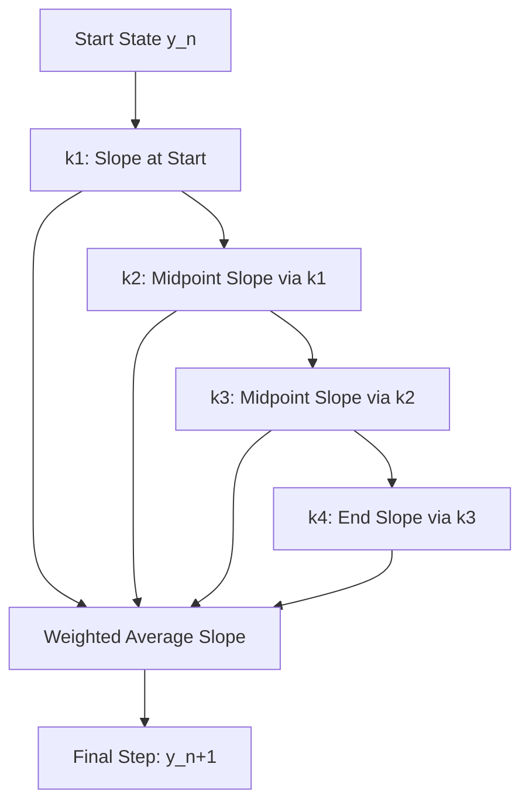

# **Chapter 7: Initial Value Problems I**

---

# **Introduction**

Having mastered the static tools of calculus—differentiation and integration—we now confront the central task of computational physics: **simulating change over time**. The fundamental laws of nature, from classical mechanics to quantum evolution, are expressed as **Differential Equations**. These laws do not tell us where a system *is*; they tell us the rules for how its state *moves* from one moment to the next.

This chapter addresses the **Initial Value Problem (IVP)**: given a system's precise state at a starting time $t_0$, how do we compute its entire future trajectory? We will translate the continuous, analytical language of differential equations into discrete, algebraic algorithms known as "Time Steppers." Our journey begins with the intuitive but flawed **Euler's Method** and culminates in the "Scientific Standard" of numerical integration: the **Runge-Kutta** family.

---

# **Chapter 7: Outline**

| **Sec.** | **Title** | **Core Ideas & Examples** |
| :--- | :--- | :--- |
| **7.1** | **The March of Time (IVP)** | State vectors; initial conditions; the "What happens next?" problem; $dy/dt = f(t, y)$. |
| **7.2** | **Euler's Method (The Baseline)** | Direct linear extrapolation; $\mathcal{O}(h)$ global error; the "Tangent Drift" problem. |
| **7.3** | **Stability and Energy Drift** | Why simple methods fail over long times; accumulation of local errors; conservative systems. |
| **7.4** | **Runge-Kutta Methods (RK2/RK4)** | The predictor-corrector idea; midpoint sampling; the $\mathcal{O}(h^4)$ magic; the "Workhorse" of physics. |
| **7.5** | **Adaptive Stepsizing (The Smart March)** | Error estimation ($RK45$); automatically scaling $h$ for steep transitions; precision control. |
| **7.6** | **Systems of ODEs** | Converting 2nd-order (Newton) to 1st-order systems; the state vector $\mathbf{y} = [x, v]^T$. |

---

## **7.1 The Initial Value Problem (IVP)**

---

In physics, a first-order ODE takes the form:
$$ \frac{dy}{dt} = f(t, y), \quad y(t_0) = y_0 $$
The function $f(t, y)$ defines a **slope field** (or velocity field). To solve the IVP, we must "march" through this field, starting at $y_0$, and use the rules of $f$ to find the next state.

---

## **7.2 Euler's Method: The Simple Step**

---

Euler's method is the most basic time-stepper. It assumes the slope stays constant for the entire duration of the step $h$:
$$ y_{n+1} = y_n + h \cdot f(t_n, y_n) $$

!!! failure "Euler's Tangent Drift"
    Because Euler only looks at the slope at the **beginning** of the step, it cannot "see" the curve ahead. For a circular orbit, Euler's method always moves along the tangent, causing the orbiting object to spiral outward and gain energy forever. It is **First-Order Accurate** ($\mathcal{O}(h)$) and generally too unstable for professional science.

---

## **7.3 Runge-Kutta 4th Order (RK4): The Standard**

---

To improve accuracy, we should sample the slope at multiple points within the interval. The **RK4 Method** samples the slope four times—at the start, twice in the middle, and at the end—and takes a weighted average.

**The Step Formula:**
$$ y_{n+1} = y_n + \frac{h}{6}(k_1 + 2k_2 + 2k_3 + k_4) $$

!!! tip "RK4 is the Scientific Standard"
    RK4 is **Fourth-Order Accurate** ($\mathcal{O}(h^4)$). If you halve the step size $h$, the error drops by a factor of **16**. It is the default "go-to" algorithm for almost any ODE that isn't extremely "stiff."

---

## **7.4 Adaptive Stepsizing: The Smart March**

---

Not all steps are equal. In a simulation of a comet, the motion is slow and boring far from the sun, but fast and complex during a flyby. A fixed step size $h$ is wasteful in the slow regions and inaccurate in the fast ones.

**Adaptive Solvers (like `solve_ivp` in Python):**
1.  Take an RK4 step and an RK5 step simultaneously.
2.  Compare the results. The difference is an estimate of the **local error**.
3.  If the error is too high, reject the step and shrink $h$.
4.  If the error is tiny, increase $h$ to save time.

---

## **7.5 Converting Higher-Order Systems**

---

Newton's Law $F = m \frac{d^2x}{dt^2}$ is a **second-order** ODE. Standard solvers only accept **first-order** systems. To bridge this gap, we define a **State Vector** $\mathbf{y} = [x, v]^T$ and transform the one 2nd-order ODE into two 1st-order ODEs:

$$ \frac{dx}{dt} = v, \quad \frac{dv}{dt} = \frac{1}{m} F(x, v, t) $$

---

## **Summary: ODE Solver Comparison**

---

| Method | Order (Global) | Stability | Best For | Note |
| :--- | :--- | :--- | :--- | :--- |
| **Forward Euler** | $\mathcal{O}(h)$ | Very Poor | Intuition only | Spins out of orbits instantly |
| **RK2 (Midpoint)** | $\mathcal{O}(h^2)$ | Moderate | Simple simulations | Predictor-Corrector logic |
| **RK4** | $\mathcal{O}(h^4)$ | High | **General Physics** | The "Standard" workhorse |
| **RK45 (DOPRI853)**| Adaptive | Excellent | **Production Science** | `scipy.integrate.solve_ivp` |

---

## **References**

---

[1] Runge, C. (1895). Über die numerische Auflösung von Differentialgleichungen. *Mathematische Annalen*.

[2] Press, W. H., et al. (2007). *Numerical Recipes: The Art of Scientific Computing*. Cambridge University Press.

[3] Butcher, J. C. (2016). *Numerical Methods for Ordinary Differential Equations*. Wiley.

[4] Dormand, J. R., & Prince, P. J. (1980). A family of embedded Runge-Kutta formulae. *Journal of Computational and Applied Mathematics*.

[5] Iserles, A. (2008). *A First Course in the Numerical Analysis of Differential Equations*. Cambridge University Press.