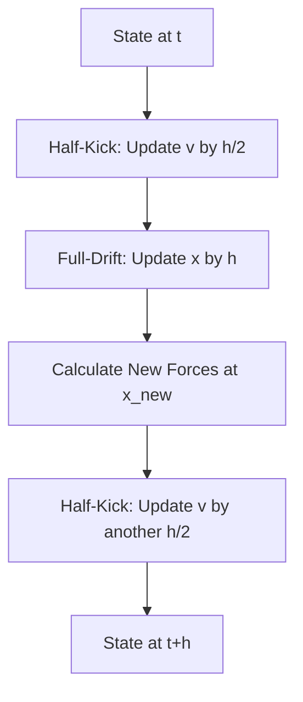

# **Chapter 8: Initial Value Problems II (Symplectic)**

---

# **Introduction**

In Chapter 7, we established **Runge-Kutta 4th Order (RK4)** as the "Standard" for general simulation. However, for a specific and vital class of physics—**Hamiltonian Systems** (like planetary orbits or molecular vibrations)—RK4 has a fatal flaw. While it is extremely accurate in the short term, it does not respect the underlying conservation laws of the universe. Over long periods, RK4 "drifts," causing simulated planets to spiral into the sun or molecules to spontaneously heat up.

This chapter introduces **Symplectic Integrators**. These are "structure-preserving" algorithms designed specifically to conserve energy and phase-space volume over infinite time. By moving from the general-purpose RK4 to the specialized **Verlet** and **Leapfrog** algorithms, we shift our focus from local precision to **global faithfulness**, ensuring our digital solar systems remain stable for billions of steps.

---

# **Chapter 8: Outline**

| **Sec.** | **Title** | **Core Ideas & Examples** |
| :--- | :--- | :--- |
| **8.1** | **The Problem of Energy Drift** | Why RK4 fails for long-term orbits; monotonic error accumulation; conservative vs. dissipative systems. |
| **8.2** | **Symplectic Geometry** | Phase space conservation; Liouville’s Theorem; the "Shadow Hamiltonian." |
| **8.3** | **The Verlet Algorithm** | Position-only updates; $\mathcal{O}(h^2)$ accuracy; time-reversibility; molecular dynamics baseline. |
| **8.4** | **Velocity Verlet (The Workhorse)** | The "Kick-Drift-Kick" sequence; synchronous $x$ and $v$; the MD standard. |
| **8.5** | **The Leapfrog Algorithm** | Staggered time grids; celestial mechanics; $v$ at $t+h/2$; stability in N-body systems. |
| **8.6** | **Global Stability over Precision** | Error bounds; why low-order symplectic beats high-order non-symplectic for orbits. |

---

## **8.1 The Problem of Energy Drift**

---

A system is **Conservative** if its total energy $E = T + V$ remains constant.
- **RK4 (Non-Symplectic):** Each step introduces a tiny, biased error. Over time, these errors add up in one direction (monotonically), causing the energy to "drift" away from the true value.
- **Symplectic Solvers:** These algorithms are designed to stay on a "Shadow" energy surface. The energy will **oscillate** around the true value but will **never drift away**.

!!! tip "Symplectic = Conservative"
    If you are simulating a system without friction (like a pendulum in a vacuum or a planet in space) for a long time, **do not use RK4**. Use a symplectic integrator like Velocity Verlet to ensure the physics remains valid.

---

## **8.2 Velocity Verlet: Kick-Drift-Kick**

---

The **Velocity Verlet** algorithm is the most popular symplectic integrator, especially in Molecular Dynamics. It updates positions and velocities in a symmetric, synchronized way:

**The Step Formula:**
1.  **Kick:** $v_{n+1/2} = v_n + \frac{h}{2} a_n$
2.  **Drift:** $x_{n+1} = x_n + h v_{n+1/2}$
3.  **Update:** $a_{n+1} = F(x_{n+1})/m$
4.  **Kick:** $v_{n+1} = v_{n+1/2} + \frac{h}{2} a_{n+1}$

---

## **8.3 The Leapfrog Algorithm**

---

Common in celestial mechanics, the **Leapfrog** algorithm is mathematically equivalent to Verlet but uses a "staggered" grid. Velocities are calculated exactly halfway between positions:

$$ v_{n+1/2} = v_{n-1/2} + h \cdot a_n $$
$$ x_{n+1} = x_n + h \cdot v_{n+1/2} $$

!!! example "The 'Leap' of Faith"
    In Leapfrog, the velocity "leaps" over the position, and the position then "leaps" over the velocity. This staggered nature is what provides its famous stability—if you reverse the time step ($h \to -h$), you perfectly backtrack the trajectory, proving the method is **time-reversible**.

---

## **8.4 Global Stability vs. Local Precision**

---

It is a common mistake to assume that a 4th-order method (RK4) is always better than a 2nd-order method (Verlet).

??? question "Why use a 2nd-order method if a 4th-order exists?"
    Precision is a measure of how close you are to the truth *now*. Stability is a measure of how well you respect the laws of physics *forever*. For a 10,000-year orbit simulation, a 2nd-order symplectic method is far superior because its error is **bounded**, whereas RK4's error will eventually exceed the size of the orbit itself.

---

## **Summary: General Purpose vs. Symplectic**

---

| Feature | RK4 (General) | Velocity Verlet (Symplectic) |
| :--- | :--- | :--- |
| **Order** | $\mathcal{O}(h^4)$ (Higher) | $\mathcal{O}(h^2)$ (Lower) |
| **Energy** | **Drifts** (accumulates) | **Oscillates** (bounded) |
| **Time-Reversible?**| **No** | **Yes** |
| **Phase Space** | Shrinks or expands | **Conserved** |
| **Best For** | Damped systems, Drag, Circuits | **Orbits, Vibrations, MD** |

---

## **References**

---

[1] Verlet, L. (1967). Computer "experiments" on classical fluids. *Physical Review*.

[2] Hairer, E., et al. (2006). *Geometric Numerical Integration*. Springer.

[3] Leimkuhler, B., & Reich, S. (2004). *Simulating Hamiltonian Dynamics*. Cambridge University Press.

[4] Frenkel, D., & Smit, B. (2001). *Understanding Molecular Simulation*. Academic Press.

[5] Tuckerman, M. E., et al. (1992). Reversible multiple time scale molecular dynamics. *Journal of Chemical Physics*.