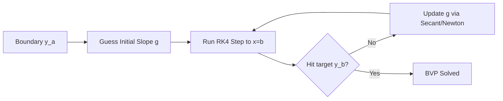

# **Chapter 9: Boundary Value Problems**

---

# **Introduction**

In the previous chapters, we mastered **Initial Value Problems (IVPs)**, where we predicted the future of a system from a single starting point. However, much of physics is not about "launching"; it is about **equilibrium**. Whether we are calculating the shape of a bridge cable, the temperature profile of a heat sink, or the wavefunction of a trapped electron, we are solving systems constrained at both ends. These are **Boundary Value Problems (BVPs)**.

A BVP is fundamentally different from an IVP because we do not have a complete set of "launch" conditions. Instead, we have "target" conditions. This chapter explores the two primary strategies for solving these multi-point constraints: the **Shooting Method**, which turns the BVP into a root-finding game, and the **Finite Difference Method**, which transforms the differential equation into a massive system of linear algebra.

---

# **Chapter 9: Outline**

| **Sec.** | **Title** | **Core Ideas & Examples** |
| :--- | :--- | :--- |
| **9.1** | **The Two-Point Constraint** | Start and End boundaries; missing initial slopes; the physics of strings and rods. |
| **9.2** | **The Shooting Method** | Converting BVP to IVP; the "Target Practice" analogy; using root-finders for slopes. |
| **9.3** | **Finite Difference Methods (FDM)** | Discretizing the domain; replacing $y''$ with stencils; the grid approach. |
| **9.4** | **The Tridiagonal Matrix ($Ay = b$)** | Assembling linear systems; boundary condition injection; efficient matrix solving. |
| **9.5** | **Eigenvalue BVPs** | The Schrödinger Equation; finding allowed energy states; the $\mathbf{H}\psi = E\psi$ matrix. |

---

## **9.1 The Two-Point Constraint**

---

A second-order BVP looks like this:
$$ y'' = f(x, y, y'), \quad y(a) = \alpha, \quad y(b) = \beta $$
Unlike an IVP, where we know $y(a)$ and $y'(a)$, here we only know $y$ at two different locations.

- **Example 1: Heat Conduction.** $T(0) = 100^\circ$C and $T(L) = 20^\circ$C. What is the temperature in the middle?
- **Example 2: Quantum Well.** $\psi(0) = 0$ and $\psi(L) = 0$. What shape of $\psi$ satisfies the wave equation?

---

## **9.2 The Shooting Method: Target Practice**

---

The **Shooting Method** treats the unknown initial slope $y'(a)$ as a variable "guess" $g$.
1.  **Guess** a slope $g$.
2.  **Shoot:** Run an IVP solver (like RK4) from $x=a$ to $x=b$.
3.  **Check:** See how far you missed the target $\beta$.
4.  **Correct:** Use a root-finder (Chapter 3) to pick a better $g$.

!!! tip "Shooting is BVP + Root Finding"
    The Shooting Method is intuitive and works for nonlinear equations, but it can be highly unstable for "stiff" problems where small changes in the initial slope lead to wildly different results at the end.

---

## **9.3 Finite Difference Methods: The Grid**

---

In the **Finite Difference Method (FDM)**, we don't "shoot." Instead, we solve for every point on a grid simultaneously. We replace the derivative $y''$ with the central difference stencil from Chapter 5:

$$ y''_i \approx \frac{y_{i+1} - 2y_i + y_{i-1}}{h^2} $$

For every point $x_i$ in the interior of the grid, the ODE becomes a simple algebraic equation relating $y_{i-1}, y_i,$ and $y_{i+1}$.

---

## **9.4 The Matrix Approach ($Ay = b$)**

---

For a linear BVP, the $N$ algebraic equations can be written as a single matrix equation. Because each point only talks to its immediate neighbors, the matrix $A$ is **Tridiagonal** (mostly zeros).

$$
\begin{pmatrix}
-2 & 1 & 0 \\
1 & -2 & 1 \\
0 & 1 & -2
\end{pmatrix}
\begin{pmatrix}
y_1 \\
y_2 \\
y_3
\end{pmatrix}
=
\begin{pmatrix}
b_1 \\
b_2 \\
b_3
\end{pmatrix}
$$

!!! example "The Power of Matrix Solving"
    Solving a tridiagonal system is extremely fast—$\mathcal{O}(N)$ instead of $\mathcal{O}(N^3)$ for a general matrix. This allows us to use thousands of grid points for extreme precision with almost zero computational cost.

---

## **9.5 Eigenvalue BVPs: Quantum States**

---

In quantum mechanics, we solve the Schrödinger Equation:
$$ \left( -\frac{\hbar^2}{2m} \frac{d^2}{dx^2} + V(x) \right) \psi(x) = E \psi(x) $$
This is a BVP where the "target" $E$ (Energy) is also unknown. Using FDM, we transform this into a **Matrix Eigenvalue Problem**:
$$ \mathbf{H} \mathbf{\psi} = E \mathbf{\psi} $$
The eigenvalues of the matrix $\mathbf{H}$ are the allowed **Energy Levels**, and the eigenvectors are the **Wavefunctions**.

---

## **Summary: BVP Method Comparison**

---

| Feature | Shooting Method | Finite Difference (FDM) |
| :--- | :--- | :--- |
| **Logic** | Iterative "Guess and Check" | Simultaneous Matrix Solve |
| **Stability** | Fragile for stiff problems | **Extremely Robust** |
| **Nonlinearity** | Handles naturally | Requires Newton iteration |
| **Complexity** | Simple to implement | Requires Linear Algebra |
| **Best For** | Nonlinear / Few-point BVPs | **Linear / High-precision / Quantum** |

---

## **References**

---

[1] Press, W. H., et al. (2007). *Numerical Recipes: The Art of Scientific Computing*. Cambridge University Press.

[2] Keller, H. B. (1992). *Numerical Methods for Two-Point Boundary-Value Problems*. Dover.

[3] Burden, R. L., & Faires, J. D. (2011). *Numerical Analysis*. Brooks/Cole.

[4] Ascher, U. M., et al. (1995). *Numerical Solution of Boundary Value Problems for Ordinary Differential Equations*. SIAM.

[5] Thijssen, J. M. (2007). *Computational Physics*. Cambridge University Press.